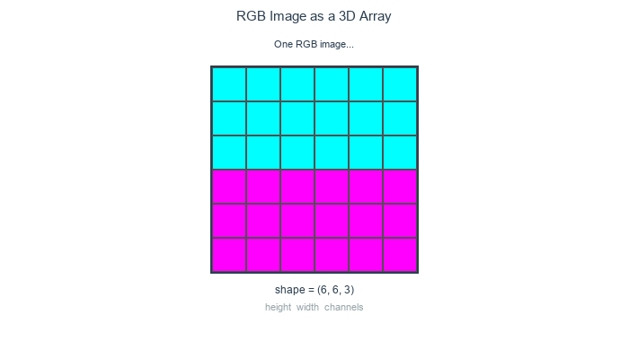
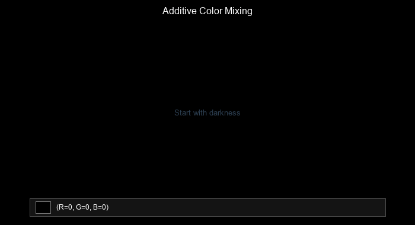
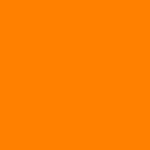
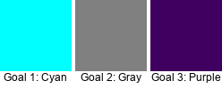

.. _module-1-1-1-color-basics:

=====================================
1.1.1 - Images as Arrays & RGB
=====================================

:Duration: 20-25 minutes
:Level: Beginner

Overview
========

A single 4K image stores 26 million pixels, three integers each, specifying red, green, and blue intensity. Manipulating these arrays is the basis for color correction, compositing, and eventually training convolutional networks.

**Learning Objectives**

By completing this module, you will:

* Understand that images are 2D arrays of numerical values (grayscale)
* Recognize the relationship between array values (0-255) and brightness
* Extend to 3D NumPy arrays with RGB channels for color images
* Create and manipulate colored images from scratch
* Grasp the additive color model and why computers use RGB

Quick Start: Your First Colorful Image
========================================

Run this code to see a split image, cyan on top, magenta on the bottom:

.. code-block:: python
   :caption: Create a two-color image in seconds
   :linenos:
   
   import numpy as np
   from PIL import Image

   # Create a 200x200 image with 3 color channels (RGB)
   image = np.zeros((200, 200, 3), dtype=np.uint8)

   # Top half: cyan 
   image[:100, :, 1] = 255  # Green channel
   image[:100, :, 2] = 255  # Blue channel

   # Bottom half: magenta 
   image[100:, :, 0] = 255  # Red channel
   image[100:, :, 2] = 255  # Blue channel

   # Convert to PIL and display
   pil_image = Image.fromarray(image)
   pil_image.show()  # Opens in default image viewer
   pil_image.save('cyan_magenta.png')  # Save as PNG

.. figure:: ../../../../images/cyan_magenta_example.png
   :width: 300px
   :align: center
   :alt: Example output showing cyan on top, magenta on bottom
   
   Cyan (top half) and magenta (bottom half)

.. tip::

    The shape of the image is `(200, 200, 3)`, respectively they are defined as  **(height, width, channels)**. The Channels dimension holds our red, green, and blue values. Height and width are the dimensions of the image, and channels are the number of color channels in the image.

Core Concept 1: Grayscale - The Foundation
==========================================

Color images use three channels per pixel. Grayscale uses one, and it is the simpler case to start with.

**A grayscale image is a 2D grid of pixels, where each pixel has a brightness value** [Gonzalez2007]_:

* **0** = black (no light)
* **255** = white (maximum light)
* **128** = medium gray (half intensity)

View any digital photograph in grayscale, and you're looking at a 2D grid...

.. code-block:: python
   :caption: Creating a simple grayscale image

   import numpy as np
   from PIL import Image

   # Create a 200x200 array filled with medium gray
   array = np.zeros((200, 200), dtype=np.uint8)
   array += 128

   # PIL interprets 2D arrays as grayscale automaticall
   image = Image.fromarray(array)  
   image.save('gray.png')

The ``Image.fromarray()`` function from Pillow converts NumPy arrays into displayable images [PillowDocs]_.

.. figure:: /content/Module_00_foundations_definitions/0.3_images_as_data/0.3.1_creating_images/lincoln.png
   :width: 700px
   :align: center
   :alt: Diagram showing how array values map to pixel brightness

   Array values directly map to pixel brightness: 0=black, 255=white, intermediate values=grays. Lincoln portrait digitized by Leon Harmon at Bell Labs (1973) [Harmon1973]_.

The ``uint8`` data type
-----------------------

The ``dtype=np.uint8`` parameter is required for image arrays [NumPyDocs]_:

* **u** = unsigned (no negative numbers)
* **int** = integer (whole numbers only)
* **8** = 8 bits per value (range: 0 to 255)

.. code-block:: python

   # Correct: uint8 for standard images
   array = np.zeros((100, 100), dtype=np.uint8)

   # Wrong: without dtype specification
   array = np.zeros((100, 100))   # Defaults to float64—PIL expects uint8 for 0-255 images
   #  PIL may misinterpret or reject float arrays

Array shape and coordinates
---------------------------

NumPy arrays use **[row, column]** indexing [NumPyDocs]_:

* **row** = y-coordinate (vertical position, 0 at top)
* **column** = x-coordinate (horizontal position, 0 at left)
* **Shape**: ``(height, width)`` where height (rows) comes first

.. code-block:: python

   array = np.zeros((200, 300), dtype=np.uint8)  # 200 tall, 300 wide

   # Set pixel at row 50, column 100 to white
   array[50, 100] = 255

   # Set bottom-right corner
   array[199, 299] = 128

.. tip::

   **Remember:** ``array[y, x]`` not ``array[x, y]``. NumPy uses row-major indexing matching mathematical matrix notation, where the first index selects the row and the second selects the column [NumPyDocs]_. This is opposite to the (x, y) convention used in many graphics systems.

Core Concept 2: Understanding Digital Images
=============================================

The fundamental insight
------------------------

**Where a grayscale pixel stores one brightness value, a color pixel stores three: red intensity, green intensity, and blue intensity.** The array gains a third axis to hold them, producing shape ``(height, width, 3)`` [Gonzalez2007]_.

   Three separate intensity layers combine into one color image. *Diagram generated with Claude - Opus 4.5*

.. code-block:: python

   # RGB array: height × width × 3 channels
   image = np.zeros((100, 150, 3), dtype=np.uint8)
   # Shape: (height=100, width=150, channels=3)
   
   # Access a specific pixel's RGB values
   pixel = image[50, 75, :]  # Returns [R, G, B]
   
   # Access just the red channel
   red_channel = image[:, :, 0]

The colon ``:`` in array indexing means **all elements** along that axis. So ``image[:, :, 0]`` reads as "every row, every column, channel 0 (red)." Similarly, ``image[50, 75, :]`` means "row 50, column 75, all channels."

When you assign a single value to a slice — for example ``image[:, :, 0] = 255`` — NumPy fills every element in that slice with the value. NumPy calls this **broadcasting**. The single number is replicated to fill every position in the target slice.

.. important::

   Array indexing uses ``image[y, x, channel]``. Did you notice **y comes first** (row), then x (column)? This follows matrix notation, where the origin (0, 0) is at the **top-left corner**.

.. admonition:: Technical Note: Display Subpixels

   This RGB encoding mirrors your display's physical structure. Each screen pixel contains three subpixels (red, green, blue) so small that your eye blends their light into perceived color [Wikipedia2024]_

Core Concept 3: The RGB Color Model
------------------------------------

RGB works by **addition**. Start with a black screen and add colored light:

* **Red (255, 0, 0)** -> Pure red light
* **Green (0, 255, 0)** -> Pure green light  
* **Blue (0, 0, 255)** -> Pure blue light
* **White (255, 255, 255)** -> All three at maximum
* **Black (0, 0, 0)** -> No light

Each channel stores values from **0 to 255** (8 bits = 256 possible values), giving us **16,777,216 total colors** (256³). This is called "24-bit true color" and exceeds the approximately 10 million colors the human eye can discriminate [Hunt2004]_, [Foley1990]_. 

   Additive color mixing: Red + Green = Yellow, all three = White. *Diagram generated with Claude - Opus 4.5*

.. note::
   
   RGB is fundamentally different from mixing paint! Paint uses **subtractive color** (CMYK). You start with white paper and pigments *subtract* wavelengths by absorbing them. That's why mixing red and green **light** creates yellow, but mixing red and green **paint** creates brown [Hunt2004]_.

Common RGB color patterns
--------------------------

A few patterns are worth memorizing [Foley1990]_:

* **Primary colors**: One channel at 255, others at 0
* **Secondary colors**: Two channels at 255, one at 0
  - Cyan `(0, 255, 255)` = Green + Blue
  - Magenta `(255, 0, 255)` = Red + Blue
  - Yellow `(255, 255, 0)` = Red + Green
* **Grayscale**: All three channels equal `(N, N, N)`
* **Pastels**: High values across all channels (light colors)
* **Dark colors**: Low values across all channels

.. admonition:: Technical Note:
   
   The human eye has three types of cone cells for color vision, but they're NOT actually "red," "green," and "blue" receptors! The L-cones peak around 559nm (yellow-green), M-cones around 530nm (green), and S-cones around 420nm (blue-violet). RGB is a computational convenience that *approximately* matches this trichromatic vision system [Gonzalez2007]_, [Hunt2004]_.

Hands-On Exercises
==================

Now it is time to apply what you've learned with three progressively challenging exercises. Each builds on the previous one using the **Execute → Modify → Create** approach [Sweller1985]_, [Mayer2020]_.

Exercise 1: Execute and explore
---------------------------------

Run ``exercise1_execute.py`` and observe the output. Try to predict what color you will see before looking at the result.

.. code-block:: bash

   python exercise1_execute.py

The script creates a 150x150 solid-color image:

.. code-block:: python
   :caption: exercise1_execute.py
   :linenos:

   import numpy as np
   from PIL import Image

   # Create a blank 150x150 image with 3 color channels
   image = np.zeros((150, 150, 3), dtype=np.uint8)

   # Set the color of every pixel
   image[:, :, 0] = 255  # Red channel   — full intensity
   image[:, :, 1] = 128  # Green channel — half intensity
   image[:, :, 2] = 0    # Blue channel  — off

   result = Image.fromarray(image, mode='RGB')
   result.save('exercise1_color.png')

   Expected output

**Reflection questions:**

* What color appears? Why?
* What would happen if you set all three channels to 255?
* What would ``(0, 0, 0)`` look like?

.. dropdown:: Solution & Explanation

   **Answer:** Orange (or orange-red)

   **Why:** Red at maximum (255), green at half intensity (128), and blue absent (0) creates an orange hue. The color ``(255, 128, 0)`` sits between pure red ``(255, 0, 0)`` and yellow ``(255, 255, 0)``.

   * Setting all channels to 255 → **White** (all light)
   * Setting all channels to 0 → **Black** (no light)

Exercise 2: Modify to achieve goals
-------------------------------------

Open ``exercise2_modify.py`` in your editor. The script starts with the same orange color as Exercise 1 — your job is to change the channel values to match each goal below. After each change, re-run the script to see the result.

.. code-block:: bash

   python exercise2_modify.py

**Goals:**

1. **Create pure cyan** — which two colors of light combine to make cyan?
2. **Create a medium gray** — what must be true about all three channels?
3. **Create a dark purple** — which channels are involved, and how do you keep it dark?

   Target colors — compare your output to these after each goal

.. dropdown:: Goal 1: What to expect

   Cyan is a **secondary color** formed by combining green and blue light. Your image should look like a bright blue-green.

.. dropdown:: Goal 2: What to expect

   Grayscale occurs when **all three channels are equal**. A value of 128 for each gives you a medium gray, right between black and white.

.. dropdown:: Goal 3: What to expect

   Purple combines red and blue. Keeping the values low (under 100) makes it dark. Your image should look like a deep violet.

.. dropdown:: Solutions

   **1. Pure cyan:**

   .. code-block:: python

      image[:, :, 0] = 0    # Red: off
      image[:, :, 1] = 255  # Green: full
      image[:, :, 2] = 255  # Blue: full
      # Result: (0, 255, 255)

   **2. Medium gray:**

   .. code-block:: python

      image[:, :, 0] = 128
      image[:, :, 1] = 128
      image[:, :, 2] = 128
      # Result: (128, 128, 128)

   **3. Dark purple:**

   .. code-block:: python

      image[:, :, 0] = 64   # Red: low
      image[:, :, 1] = 0    # Green: off
      image[:, :, 2] = 96   # Blue: medium-low
      # Result: (64, 0, 96) or similar

   Try ``(80, 0, 120)`` for a slightly brighter purple.

Exercise 3: Create a gradient pattern
---------------------------------------

Open ``exercise3_create.py`` in your editor. The script is mostly complete but has three TODOs for you to fill in. Your goal is to create a 200x200 image that transitions smoothly from pure red on the left to pure blue on the right.

.. code-block:: bash

   python exercise3_create.py

.. dropdown:: Hint 1: Think about proportions

   As you move from left to right across the image, each column represents a position from 0 to ``width - 1``. You can convert this to a value from 0 to 255 using integer division: ``col * 255 // width``.

.. dropdown:: Hint 2: Which channels change?

   * The **red** channel should start at 255 (left edge) and decrease to 0 (right edge).
   * The **blue** channel should start at 0 (left edge) and increase to 255 (right edge).
   * The **green** channel stays at 0 throughout.

.. dropdown:: Hint 3: Partial code

   .. code-block:: python

      proportion = col * 255 // width
      image[:, col, 0] = 255 - proportion  # Red decreases
      image[:, col, 2] = ...               # Blue increases (what goes here?)

.. dropdown:: Complete Solution

   .. code-block:: python
      :linenos:
      :emphasize-lines: 5-7

      for col in range(width):
          # How far across the image (0 at left, 255 at right)
          proportion = col * 255 // width

          image[:, col, 0] = 255 - proportion  # Red decreases
          image[:, col, 2] = proportion         # Blue increases
          # Green stays 0

   .. figure:: visuals/gradient_column_by_column.gif
      :width: 700px
      :align: center
      :alt: Animated diagram showing gradient built column by column

      The loop builds the gradient one column at a time. *Diagram generated with Claude - Opus 4.5*

   **How it works:**

   * ``col * 255 // width`` calculates a proportion: when ``col=0`` (left edge), value is 0; when ``col=width-1`` (right edge), value is ~255
   * Red channel: ``255 - proportion`` starts at 255 (left) and decreases to 0 (right)
   * Blue channel: ``proportion`` starts at 0 (left) and increases to 255 (right)
   * The result is a smooth transition through purples in the middle where red and blue overlap

**Make It Your Own**

After completing the TODOs, try these variations by editing the script directly:

* Change ``height`` and ``width`` to different values
* Create a **vertical** gradient by looping over rows instead of columns
* Create a **yellow-to-cyan** gradient (which channels need to change?)
* Create a **diagonal** gradient using both row and column position

.. dropdown:: Challenge Extension: Diagonal Gradient

   Create a gradient that runs diagonally from **red at top-left** to **blue at bottom-right**.

   **Hints:**

   * You need to consider BOTH the row (y) and column (x) position
   * One approach: calculate a "progress" value based on ``(row + col) / (height + width - 2)``
   * Red should be maximum at (0,0) and minimum at (height-1, width-1)
   * Blue should be the opposite

   This extends the horizontal gradient by requiring you to think in two dimensions simultaneously.

Summary
=======

**Key takeaways:**

An RGB image is a 3D NumPy array with shape ``(height, width, 3)``. Each pixel holds three intensity values ranging from 0 to 255, one per color channel, and additive mixing determines the perceived color. The indexing convention ``image[y, x, channel]`` places rows before columns, matching matrix notation rather than typical graphics (x, y) coordinates. When all three channel values are equal, the result is grayscale; unequal values produce colors. You can generate images entirely through array operations, without loading external image files.

**Common pitfalls to avoid:**

* Don't confuse RGB (additive/light) with CMYK (subtractive/paint)
* Remember: `image[row, column]` not `image[x, y]`
* Always use `dtype=np.uint8` for standard 0-255 image data
* Different libraries may use BGR instead of RGB (such as OpenCV!) [OpenCV2024]_ 

References
==========

.. [Foley1990] Foley, J.D., van Dam, A., Feiner, S.K., and Hughes, J.F. (1990). *Computer Graphics: Principles and Practice* (2nd ed.). Addison-Wesley. ISBN: 0-201-12110-7. [Chapters 13 on color models and RGB fundamentals]

.. [Gonzalez2007] Gonzalez, R.C. and Woods, R.E. (2007). *Digital Image Processing* (3rd ed.). Pearson. [Chapter 6 on color image processing and RGB representation]

.. [Hunt2004] Hunt, R.W.G. (2004). *The Reproduction of Colour* (6th ed.). Wiley. ISBN: 0-470-02425-9. [Comprehensive treatment of color science and trichromatic vision]

.. [Mayer2020] Mayer, R.E. (2020). *Multimedia Learning* (3rd ed.). Cambridge University Press. [Visual-first learning and dual coding theory]

.. [Sweller1985] Sweller, J. and Cooper, G. (1985). "The use of worked examples as a substitute for problem solving in learning algebra." *Cognition and Instruction*, 2(1), 59-89. [Cognitive load theory and scaffolded learning]

.. [NumPyDocs] Harris, C.R., et al. (2020). "Array programming with NumPy." *Nature*, 585, 357–362. https://doi.org/10.1038/s41586-020-2649-2

.. [PillowDocs] Clark, A. (2015). *Pillow (PIL Fork) Documentation*. https://pillow.readthedocs.io/ [Image manipulation with Python]

.. [Harmon1973] Harmon, L.D. (1973). "The Recognition of Faces." *Scientific American*, 229(5), 71-82. [Lincoln portrait pixel demonstration - public domain historical image]

.. [OpenCV2024] OpenCV Team. (2024). "Color Space Conversions." *OpenCV Documentation*. https://docs.opencv.org/4.x/d8/d01/group__imgproc__color__conversions.html [BGR color ordering in OpenCV]

.. [Wikipedia2024] Wikipedia contributors. (2024). "Subpixel rendering." *Wikipedia, The Free Encyclopedia*. https://en.wikipedia.org/wiki/Subpixel_rendering [Display subpixel structure and RGB stripe arrangement]