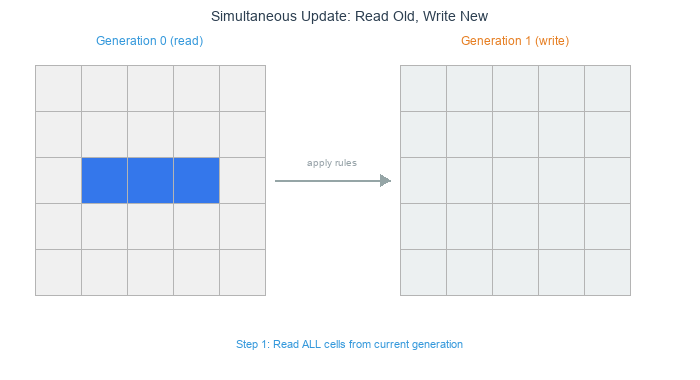
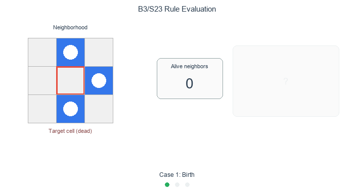
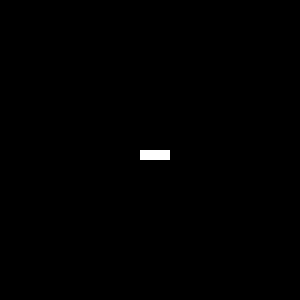
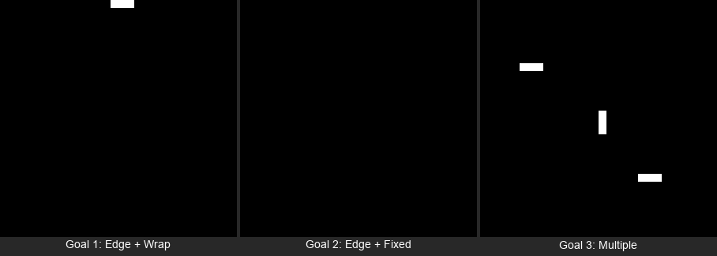

==========================================
1.2.2: Cellular Automata (Game of Life)
==========================================

:Duration: 15-20 minutes
:Level: Beginner

Overview
========

Cellular automata, popularized by Conway's Game of Life [Gardner1970]_, transform simple rules into complex, evolving patterns that seem alive. In this module, you'll discover how Conway's Game of Life creates emergent behavior from just a few mathematical rules, showcasing how complexity arises from simplicity in computational systems [Wolfram2002]_.

**Learning Objectives**

By completing this exercise, you will:

* Understand how cellular automata generate dynamic patterns from simple rules
* Practice Conway's Game of Life rules and their implementation
* Learn neighbor calculation techniques using convolution
* Watch patterns move, blink, and persist without ever programming those behaviors
* Create evolving visual patterns that change over time

Quick Start: See Life In Action
===============================

Five cells on a 20x20 grid. Eight frames later, they have walked diagonally without any movement logic:

.. code-block:: python
   :caption: Create Conway's Game of Life glider animation
   :linenos:

   import numpy as np
   from PIL import Image
   from scipy.ndimage import convolve
   import imageio

   def grid_to_image(grid, scale=8):
       """Convert binary grid to grayscale image."""
       return np.repeat(np.repeat(grid * 255, scale, axis=0), scale, axis=1).astype(np.uint8)

   grid = np.zeros((20, 20), dtype=int)
   grid[8:11, 8:11] = [[0, 1, 0], [0, 0, 1], [1, 1, 1]]  # Glider

   # Moore neighborhood kernel (counts 8 surrounding cells, excludes center)
   kernel = np.array([[1, 1, 1],
                      [1, 0, 1],
                      [1, 1, 1]])

   frames = []
   for step in range(8):
       frames.append(grid_to_image(grid))
       neighbor_count = convolve(grid, kernel, mode='wrap')
       # Apply B3/S23 rules
       birth = (neighbor_count == 3)
       survival = (grid == 1) & (neighbor_count == 2)
       grid = (birth | survival).astype(int)

   imageio.mimsave('glider_animation.gif', frames, fps=2, duration=0.5)

.. dropdown:: Key Functions Used Above

   **NumPy:** ``np.zeros(shape, dtype)``
      Creates an array filled with zeros.
      ``np.zeros((20, 20), dtype=int)`` makes a 20x20 grid where every cell starts dead.

   **NumPy:** ``np.repeat(array, repeats, axis)``
      Repeats each element of an array a specified number of times along the given axis.
      Here we use it to upscale each grid cell into a visible block of pixels --
      ``np.repeat(grid, 8, axis=0)`` turns each row into 8 identical rows,
      making a 20x20 grid become 160x160 pixels.

   **SciPy:** ``convolve(input, weights, mode)``
      Slides a small matrix (kernel) across every position in the input,
      computing a weighted sum at each location [SciPyDocs]_.
      With our 3x3 kernel of ones (center 0), it counts each cell's 8 neighbors in one call.
      ``mode='wrap'`` connects opposite edges so the grid behaves as a torus.

   **NumPy:** ``np.stack(arrays, axis)``
      Joins a sequence of arrays along a new axis.
      In Exercise 1 below, ``np.stack([gray, gray, gray], axis=2)``
      creates an RGB image from a grayscale grid with shape ``(H, W, 3)``.

.. figure:: visuals/glider_animation.gif
   :width: 400px
   :align: center
   :alt: Game of Life patterns including glider, block, and beehive

   Various Game of Life patterns: gliders move, blocks stay still, beehives remain stable

.. Note::

   Notice how the "glider" pattern appears to move across the grid! The glider moves one cell diagonally every 4 generations. Yet, the movement was never defined. This pattern emerges from local birth/death rules applied.

Core Concepts
=============

Core Concept 1: Cellular Automata Fundamentals
----------------------------------------------

Start with a grid of cells, each alive or dead. Define a rule that counts neighbors and decides the next state. Step forward, updating every cell at once. This loop of grid, rules, and synchronous update defines a **cellular automaton** [Wolfram2002]_:

1. **Grid**: A regular array of cells, each in one of several states
2. **Rules**: Mathematical conditions that determine state changes
3. **Time**: Discrete steps where all cells update simultaneously

.. code-block:: python

   # Basic CA structure
   grid = np.zeros((height, width), dtype=int)  # 0 = dead, 1 = alive

   for generation in range(num_steps):
       grid = apply_rules(grid)  # All cells update together

This framework generates four qualitatively different dynamics [Wolfram2002]_: static equilibria, periodic cycles, traveling structures, and unbounded chaotic transients.

.. important::

   The key insight is **simultaneity**. All cells update at the same time based on the current state, not the partially updated state. This creates predictable, deterministic evolution [Wolfram2002]_.

   Simultaneous update: all cells compute from the same source state, then the grid updates at once. *Diagram generated with Claude - Opus 4.5*

Conway's Game of Life Rules (B3/S23)
^^^^^^^^^^^^^^^^^^^^^^^^^^^^^^^^^^^^

The **Game of Life** uses four simple rules based on each cell's eight neighbors (the **Moore neighborhood**) [Gardner1970]_:

1. **Birth**: A dead cell with exactly 3 living neighbors becomes alive
2. **Survival**: A living cell with 2 or 3 living neighbors stays alive
3. **Death by isolation**: A living cell with fewer than 2 neighbors dies
4. **Death by overcrowding**: A living cell with more than 3 neighbors dies

.. code-block:: python

   # Game of Life rules in code
   birth = (neighbor_count == 3) & (grid == 0)
   survival = (neighbor_count >= 2) & (neighbor_count <= 3) & (grid == 1)
   new_grid = (birth | survival).astype(int)

These rules create three categories of patterns [Adamatzky2010]_:

* **Still lifes**: Patterns that never change (blocks, beehives)
* **Oscillators**: Patterns that repeat in cycles (blinkers, toads)
* **Spaceships**: Patterns that move across the grid (gliders, lightweight spaceships)

.. note::

   John Conway designed these rules in 1970 [Gardner1970]_ to simplify John von Neumann's 29-state cellular automaton [VonNeumann1966]_. Conway wanted a system where interesting behavior would emerge but not grow indefinitely. The formal treatment of these rules appears in *Winning Ways for Your Mathematical Plays* [BerlekampConwayGuy2004]_, co-authored by Conway himself.

   B3/S23 rule evaluation: count alive neighbors, then apply birth, survival, or death rule. *Diagram generated with Claude - Opus 4.5*

Core Concept 2: Pattern Classification in Game of Life
-------------------------------------------------------

Each category has recognizable signatures [Adamatzky2010]_. Here is what to look for:

**Still Lifes: Stable Forever**

These patterns never change once formed. The most common is the **block** [LifeWiki]_:

.. code-block:: text

   Generation 0:    Generation 1:    Generation 2:

   . . . .          . . . .          . . . .
   . ■ ■ .    →     . ■ ■ .    →     . ■ ■ .
   . ■ ■ .          . ■ ■ .          . ■ ■ .
   . . . .          . . . .          . . . .

Each living cell has exactly 3 living neighbors (including diagonals), so they all survive. Each dead cell has fewer than 3 living neighbors, so none are born. Perfect stability!

**Oscillators: Rhythmic Patterns**

These patterns repeat in cycles. The **blinker** alternates every generation:

.. code-block:: text

   Generation 0:    Generation 1:    Generation 2:

   . . . . .        . . ■ . .        . . . . .
   . ■ ■ ■ .   →    . . ■ . .   →    . ■ ■ ■ .
   . . . . .        . . ■ . .        . . . . .

The horizontal line becomes vertical, then back to horizontal, forming a **period-2 oscillator** [LifeWiki]_.

.. figure:: visuals/blinker_oscillator_theory.gif
   :width: 250px
   :align: center
   :alt: Blinker oscillator animation showing horizontal to vertical oscillation

   Blinker oscillator demonstrating horizontal ↔ vertical transformation (always 3 cells)

The **beacon oscillator** is more complex, alternating between 6 and 8 living cells:

.. code-block:: text

   Generation 0:    Generation 1:    Generation 2:

   ■ ■ . .          ■ ■ . .          ■ ■ . .
   ■ . . .    →     ■ ■ . .    →     ■ . . .
   . . . ■          . . ■ ■          . . . ■
   . . ■ ■          . . ■ ■          . . ■ ■

.. figure:: visuals/beacon_oscillator_theory.gif
   :width: 300px
   :align: center
   :alt: Beacon Oscillator animation displaying alternation between 6 & 8 cells.

   Beacon Oscillator animation displaying alternation between 6 & 8 living cells.

**Spaceships: Moving Patterns**

Unlike oscillators, which transform in place, spaceships reconstruct themselves at a new grid position each cycle. The **glider** moves diagonally:

.. code-block:: text

   Step 0:          Step 1:          Step 2:          Step 4:

   . ■ . . .        . . . . .        . . . . .        . . . . .
   . . ■ . .   →    ■ . ■ . .   →    . . ■ . .   →    . . . ■ .
   ■ ■ ■ . .        . ■ ■ . .        ■ . ■ . .        . . ■ ■ .
   . . . . .        . ■ . . .        . ■ ■ . .        . . ■ . .

The glider recreates itself one position down and to the right every 4 generations [Gardner1970]_, creating the illusion of movement. Interestingly, the glider was discovered by Richard K. Guy in 1969 while tracking the R-pentomino evolution [Roberts2015]_.

.. figure:: visuals/spaceship_theory.gif
   :width: 300px
   :align: center
   :alt: Glider spaceship animation showing diagonal movement

   Glider spaceship demonstrating diagonal movement while maintaining shape

.. important::

   **Pattern Recognition Tip**: Look at the neighbor counts. Still lifes have balanced counts: every living cell has exactly 2 or 3 neighbors, every dead cell has fewer than 3. Oscillators? Unstable boundary cells that alternate between birth and death. Spaceships are subtler: asymmetric neighbor distributions create a directional "lean" that shifts the pattern each cycle.

Understanding the Beacon Oscillator
^^^^^^^^^^^^^^^^^^^^^^^^^^^^^^^^^^^^

.. figure:: visuals/beacon_oscillator_theory.gif
   :width: 300px
   :align: center
   :alt: Beacon oscillator animation showing compact and expanded forms

   Beacon oscillator demonstrating 6→8→6→8 cell cycle over 4 generations

**The Beacon's Two States:**

*Compact form (6 cells):*
- Each corner block is stable (each cell has exactly 3 neighbors)
- The gap between blocks prevents interaction

*Expanded form (8 cells):*
- The middle cells are born because they suddenly have exactly 3 neighbors
- This happens when the corner blocks "reach toward" each other

**Why It Oscillates:**

1. **Generation 0** (compact): Corner cells are stable, middle positions have exactly 3 neighbors → birth
2. **Generation 1** (expanded): Middle cells now exist, but they destabilize the corners → some corner cells die
3. **Generation 2** (compact): Back to original state, cycle repeats

This predictable 6→8→6→8 pattern makes the beacon perfect for demonstrating how Game of Life rules create rhythmic, observable changes.

Placing Patterns in Code
^^^^^^^^^^^^^^^^^^^^^^^^^

Every Game of Life pattern is a small 2D shape that you place onto the grid using array slicing.
The technique: read the visual pattern **row by row**, converting filled cells (alive) to ``1`` and
empty cells (dead) to ``0``, then assign the result to a grid region:

.. code-block:: python

   # Horizontal blinker (1 row x 3 columns):
   # ■ ■ ■
   grid[10, 5:8] = [1, 1, 1]

   # Vertical blinker (3 rows x 1 column):
   # ■
   # ■
   # ■
   grid[10:13, 5] = [1, 1, 1]

   # Glider (3 rows x 3 columns) -- read row by row:
   # . ■ .     →  [0, 1, 0]
   # . . ■     →  [0, 0, 1]
   # ■ ■ ■     →  [1, 1, 1]
   grid[10:13, 5:8] = [[0, 1, 0], [0, 0, 1], [1, 1, 1]]

The slice ``grid[row:row+height, col:col+width]`` selects the rectangle where the pattern
is placed. To **rotate** a pattern, rearrange the rows. For example, a glider heading the
opposite direction (up-left instead of down-right):

.. code-block:: python

   # Glider rotated 180 degrees:
   # ■ ■ ■     →  [1, 1, 1]
   # ■ . .     →  [1, 0, 0]
   # . ■ .     →  [0, 1, 0]
   grid[10:13, 5:8] = [[1, 1, 1], [1, 0, 0], [0, 1, 0]]

Core Concept 3: Neighbor Calculation with Convolution
------------------------------------------------------

A standard approach to neighbor counting uses **2D convolution** [SciPyDocs]_ with a kernel shaped like the Moore neighborhood:

.. code-block:: python

   # Neighbor counting kernel (excludes center cell)
   kernel = np.array([[1, 1, 1],
                      [1, 0, 1],
                      [1, 1, 1]])

   # Count neighbors for all cells simultaneously
   neighbor_count = convolve(grid, kernel, mode='wrap')

This approach calculates all neighbor counts in parallel, making the algorithm much faster than nested loops. The `mode='wrap'` creates **toroidal boundary conditions** [Wolfram2002]_ where the edges connect to the opposite sides.

.. figure:: visuals/moore_neighborhood_theory.png
   :width: 600px
   :align: center
   :alt: Moore neighborhood diagram showing 8 neighbors and convolution kernel

   The Moore neighborhood: 8 cells surrounding the center cell, and the corresponding convolution kernel that counts them. Diagram generated with Claude - Opus 4.5

Core Concept 4: Boundary Conditions
------------------------------------

How you handle grid edges dramatically affects pattern behavior [Flake1998]_:

* **Wrap-around (torus)**: `mode='wrap'` -> patterns can move continuously
* **Fixed edges**: `mode='constant'` -> boundaries act as permanent barriers
* **Reflective**: Custom implementation -> patterns bounce off edges

.. code-block:: python

   # Different boundary conditions
   wrap_neighbors = convolve(grid, kernel, mode='wrap')      # Toroidal
   fixed_neighbors = convolve(grid, kernel, mode='constant') # Dead boundary

   # Creates very different evolutionary behaviors!

For artistic applications, wrap-around often produces more visually interesting results [Flake1998]_ because patterns can interact across the entire space.

.. figure:: visuals/boundary_conditions_theory.gif
   :width: 600px
   :align: center
   :alt: Boundary conditions comparison showing wrap-around vs fixed edges

   Comparison of boundary conditions: wrap-around (left) vs fixed edges (right) with glider pattern

Hands-On Exercises
==================

Now it is time to apply what you've learned with three progressively challenging exercises. Each builds on the previous one using the **Execute → Modify → Create** approach [Sweller1985]_, [Mayer2020]_.

Exercise 1: Execute and explore
---------------------------------

The **blinker** is the simplest oscillator: three cells, period 2. Run the script below to watch it flip between horizontal and vertical orientations.

.. code-block:: bash

   python exercise1_execute.py

.. tip:: **NumPy Function:** ``np.sum(array)``

   Returns the sum of all elements in the array. Since living cells are 1
   and dead cells are 0, ``np.sum(grid)`` counts the total living cells.

   Expected output: the blinker after 6 (even) generations returns to its original horizontal form

**Reflection questions:**

* Does the living cell count change, or does it stay constant at 3 cells?
* Can you visualize how the horizontal line becomes vertical, then back to horizontal?
* Based on the pattern classification section, what type of pattern is this and why?

.. dropdown:: Solution & Explanation

   **What happened:**

   1. The blinker maintains exactly 3 living cells throughout all generations
   2. Generation 1, 3, 5... = vertical line (3 cells in a column)
   3. Generation 2, 4, 6... = horizontal line (3 cells in a row)
   4. The pattern repeats every 2 generations (period-2 oscillator)

   **Key insights:**

   * This is a **period-2 oscillator** that repeats every 2 generations
   * The cell count stays constant (always 3), but the *shape* changes
   * The end cells die (only 1 neighbor each), while the middle cell births 2 new cells above/below
   * Unlike still lifes (never change) or spaceships (move), oscillators transform but stay in place

Exercise 2: Modify blinker variations
--------------------------------------

Open ``exercise2_modify.py`` in your editor. The script starts with a blinker at the center of a 30x30 grid. Your job is to change the marked values to achieve each goal below. After each change, re-run the script to see the result.

.. code-block:: bash

   python exercise2_modify.py

**Goals:**

1. **Move to the very top edge**: Change the blinker position to row 0. Does it still oscillate?
2. **Switch boundary mode**: Keep the edge blinker and change ``mode='wrap'`` to ``mode='constant'``. What happens?
3. **Multiple blinkers**: Add several blinkers at different positions and orientations

   Target outputs. Compare your results to these after each goal

.. dropdown:: Goal 1: What to expect

   Change the pattern placement line to ``grid[0, 14:17] = [1, 1, 1]``. With wrap-around boundaries, the blinker oscillates normally even at the very top edge because the grid wraps: cells above row 0 "connect" to the bottom rows. The blinker survives.

.. dropdown:: Goal 2: What to expect

   Keep the blinker at row 0 and change the boundary mode to ``mode='constant'`` inside the ``game_of_life_step`` function. With fixed boundaries, cells beyond the edge are treated as permanently dead. The edge blinker loses neighbors it needs to survive and **dies within 2 generations**. The grid goes completely empty! This dramatically shows how boundary conditions affect pattern survival.

.. dropdown:: Goal 3: What to expect

   Add multiple blinker lines. Each blinker oscillates independently as long as they are far enough apart. Try mixing horizontal and vertical blinkers to see both orientations.

   **Experiment -- what happens when blinkers overlap?** Place two horizontal blinkers just 2 rows apart (e.g., rows 14 and 16). 

.. dropdown:: Solutions

   **1. Edge blinker (row 0):**

   .. code-block:: python

      grid[0, 14:17] = [1, 1, 1]  # At the very top edge

   **2. Fixed boundaries:**

   .. code-block:: python

      # In the game_of_life_step function, change:
      neighbor_count = convolve(grid, kernel, mode='constant')  # Fixed edges
      # Combined with edge placement, the blinker dies!

   **3. Multiple blinkers:**

   .. code-block:: python

      grid[8, 5:8] = [1, 1, 1]       # Horizontal blinker
      grid[14:17, 15] = [1, 1, 1]    # Vertical blinker
      grid[22, 20:23] = [1, 1, 1]    # Another horizontal blinker

Exercise 3: Create a pattern garden
-------------------------------------

Open ``exercise3_create.py`` in your editor. The helper functions and grid setup are provided. Complete the three TODOs to place multiple patterns on the grid and bring the garden to life.

.. code-block:: bash

   python exercise3_create.py

.. dropdown:: Hint 1: Review the pattern shapes

   Look back at Core Concept 2 above. The beacon's bottom-right block mirrors the top-left block:

   * Top-left: ``[[1, 1], [1, 0]]``, which is the full top row, left cell on bottom
   * Bottom-right: think of it as the opposite. What fills the bottom row and the right cell on top?

   For the glider, read the visual pattern row by row, converting filled squares to 1 and empty to 0.

.. dropdown:: Hint 2: Array indexing for 2D patterns

   A 2D list like ``[[0, 1], [1, 1]]`` assigns values row-by-row into a grid slice.
   ``grid[7:9, 7:9]`` means rows 7 and 8, columns 7 and 8 (a 2x2 region).
   ``grid[20:23, 10:13]`` means rows 20-22, columns 10-12 (a 3x3 region).

.. dropdown:: Hint 3: Partial code

   .. code-block:: python

      # TODO 1: Bottom-right block of beacon
      grid[7:9, 7:9] = [[0, 1], [1, 1]]

      # TODO 2: Glider (first row is done, complete the rest)
      grid[20:23, 10:13] = [[0, 1, 0], ...]  # What are rows 2 and 3?

      # TODO 3: The loop body
      for generation in range(20):
          grid = game_of_life_step(grid)
          print(...)  # Print generation number and np.sum(grid)

.. dropdown:: Complete Solution

   .. code-block:: python
      :linenos:
      :emphasize-lines: 5-6, 12, 17-18

      # TODO 1: Beacon bottom-right block
      grid[5:7, 5:7] = [[1, 1], [1, 0]]    # Top-left block (provided)
      grid[7:9, 7:9] = [[0, 1], [1, 1]]    # Bottom-right block

      # TODO 2: Glider spaceship
      grid[20:23, 10:13] = [[0, 1, 0], [0, 0, 1], [1, 1, 1]]

      # TODO 3: Evolution loop
      for generation in range(20):
          grid = game_of_life_step(grid)
          print(f"Generation {generation + 1}: {np.sum(grid)} living cells")

   **Expected output:**

   .. figure:: visuals/expected_exercise3.png
      :width: 320px
      :align: center
      :alt: Pattern garden showing beacon oscillator and glider after 20 generations

      Your result should look like this. The beacon stays in place while the glider moves diagonally

   **How it works:**

   * The beacon oscillates between 6 and 8 cells, staying at position (5, 5)
   * The glider moves diagonally across the grid, traveling 5 cells in 20 generations
   * Both patterns coexist independently because they are far enough apart
   * This demonstrates how different pattern types (oscillator + spaceship) can share the same grid

**Make It Your Own**

After completing the TODOs, try these variations by editing the script directly:

* Add a blinker: ``grid[row, col:col+3] = [1, 1, 1]``
* Add a block (still life): ``grid[row:row+2, col:col+2] = 1``
* Place two gliders on a collision course. What happens when they meet?
* Increase the grid to 60x60 and scatter more patterns across it

.. dropdown:: Challenge Extension: Glider Collision

   Place two gliders heading toward each other:

   .. code-block:: python

      # Glider moving down-right
      grid[5:8, 5:8] = [[0, 1, 0], [0, 0, 1], [1, 1, 1]]

      # Glider moving up-left (rotated 180 degrees)
      grid[30:33, 30:33] = [[1, 1, 1], [1, 0, 0], [0, 1, 0]]

   Run for 50+ generations and watch what the collision produces. The result depends on exactly when and where they meet. Sometimes they annihilate, sometimes they create new stable patterns!

Summary
=======

Four rules, applied uniformly, generate structures that were never programmed: gliders that walk, beacons that blink, blocks that simply persist.

**Key takeaways:**

* **Simple rules, complex outcomes** [Wolfram2002]_: Conway's four rules produce still lifes, oscillators, spaceships, and chaotic transients from one mechanism
* **Convolution enables efficient computation** - neighbor counting scales to large grids
* **Boundary conditions affect evolution** - wrap-around vs fixed edges change pattern dynamics
* **No behavior was programmed** - movement, oscillation, and stability all follow from local neighbor counting alone
* **Rule variations reshape everything** - changing B3/S23 to B36/S23 adds a single birth condition, yet the dynamics shift from controlled patterns to explosive growth

References
==========

.. [Gardner1970] Gardner, Martin. "Mathematical Games: The fantastic combinations of John Conway's new solitaire game 'life'." *Scientific American*, vol. 223, no. 4, 1970, pp. 120-123. [Original publication introducing Game of Life to the public]

.. [Wolfram2002] Wolfram, Stephen. *A New Kind of Science*. Wolfram Media, 2002. ISBN: 978-1-57955-008-0. [Comprehensive exploration of cellular automata and computational irreducibility]

.. [Flake1998] Flake, Gary William. *The Computational Beauty of Nature: Computer Explorations of Fractals, Chaos, Complex Systems, and Adaptation*. MIT Press, 1998. ISBN: 978-0-262-56127-3. [Chapter 6 covers cellular automata with artistic applications]

.. [Adamatzky2010] Adamatzky, Andrew, editor. *Game of Life Cellular Automata*. Springer, 2010. ISBN: 978-1-84996-216-2. https://doi.org/10.1007/978-1-84996-217-9 [Research compilation on GoL patterns and applications]

.. [BerlekampConwayGuy2004] Berlekamp, E. R., Conway, J. H., & Guy, R. K. (2004). *Winning ways for your mathematical plays* (2nd ed., Vol. 4, Chapter 25: "What Is Life?"). A K Peters. ISBN: 1-56881-144-6 [Conway's own formal treatment of the Game of Life rules]

.. [Roberts2015] Roberts, S. (2015). *Genius at play: The curious mind of John Horton Conway* (pp. 125-126). Bloomsbury. ISBN: 978-1-62040-593-2 [Confirms the glider was discovered by Richard K. Guy in 1969]

.. [VonNeumann1966] Von Neumann, J. (1966). *Theory of self-reproducing automata* (A. W. Burks, Ed.). University of Illinois Press. [Conway designed GoL to simplify von Neumann's 29-state cellular automaton]

.. [SciPyDocs] SciPy Developers. (2024). scipy.ndimage.convolve: N-dimensional convolution. *SciPy v1.12.0 Documentation*. https://docs.scipy.org/doc/scipy/reference/generated/scipy.ndimage.convolve.html

.. [NumPyDocs] NumPy Developers. (2024). NumPy array manipulation routines. *NumPy v1.26 Documentation*. https://numpy.org/doc/stable/reference/routines.array-manipulation.html

.. [LifeWiki] ConwayLife.com. (2024). LifeWiki: The wiki for Conway's Game of Life. https://conwaylife.com/wiki/Main_Page [Comprehensive database of patterns including block, blinker, beacon, and glider]

.. [Sweller1985] Sweller, J. (1985). Cognitive load during problem solving: Effects on learning. *Cognitive Science*, 12(2), 257-285. https://doi.org/10.1207/s15516709cog1202_4 [Foundation of cognitive load theory in instructional design]

.. [Mayer2020] Mayer, R. E. (2020). *Multimedia Learning* (3rd ed.). Cambridge University Press. ISBN: 978-1-316-63816-1 [Principles of effective multimedia instruction including worked examples]

.. dropdown:: Additional Resources

   **Simulators**

   - `Golly <http://golly.sourceforge.net/>`_: Advanced open-source cellular automata simulator

   **Educational**

   - `Elementary Cellular Automata <https://mathworld.wolfram.com/ElementaryCellularAutomaton.html>`_: Wolfram MathWorld's 1D CA reference
   - `Numberphile: Inventing Game of Life <https://www.youtube.com/watch?v=R9Plq-D1gEk>`_: John Conway explains his invention (video)
