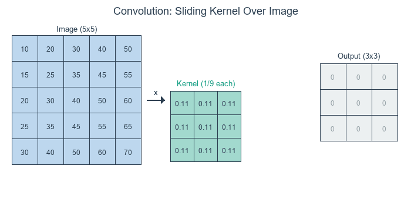
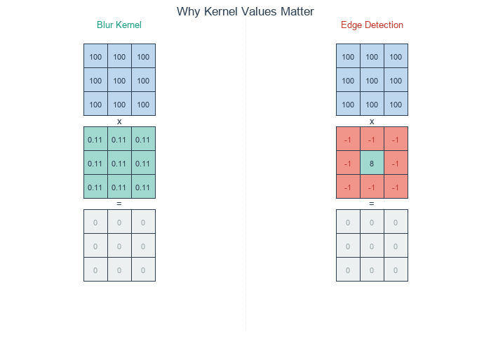
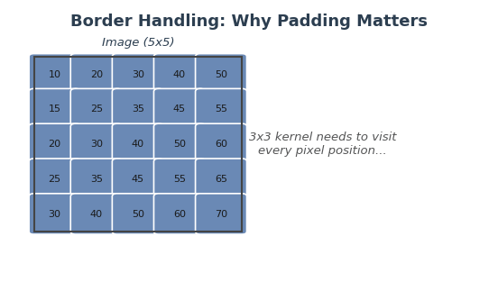

.. _module-3-4-1-convolution:

=====================================
3.4.1 - Convolution
=====================================

:Duration: 20-25 minutes
:Level: Intermediate

Overview
========

In this exercise, you will learn how **convolution** transforms images by sliding a small grid of numbers (called a **kernel**) across every pixel. This fundamental operation powers everything from image (such as Instagram and Snapchat) filters to neural network vision systems.

By the end of this module, you will understand why a simple 3x3 matrix can blur an image, detect edges, or sharpen details.

**Learning Objectives**

By completing this module, you will:

* Understand convolution as a "sliding window" operation that combines pixels with kernel weights
* Apply different kernels to achieve blur, sharpen, and edge detection effects
* Implement your own convolution function from scratch using nested loops
* Recognize convolution as the foundation of Convolutional Neural Networks (CNNs) [LeCun1998]_

Quick Start
===========

Let's see convolution in action immediately. Run this script to blur a checkerboard pattern:

:download:`Download simple_convolution.py <simple_convolution.py>`

.. code-block:: python
   :caption: simple_convolution.py - Blur a checkerboard pattern

   import numpy as np
   from PIL import Image

   # Create a checkerboard pattern with sharp edges
   CANVAS_SIZE = 256
   SQUARE_SIZE = 32
   canvas = np.zeros((CANVAS_SIZE, CANVAS_SIZE), dtype=np.float64)

   for row in range(CANVAS_SIZE):
       for col in range(CANVAS_SIZE):
           square_row = row // SQUARE_SIZE
           square_col = col // SQUARE_SIZE
           if (square_row + square_col) % 2 == 0:
               canvas[row, col] = 255.0

   # 5x5 blur kernel: each weight = 1/25, so output = mean of 25 neighbors
   KERNEL_SIZE = 5
   blur_kernel = np.ones((KERNEL_SIZE, KERNEL_SIZE)) / (KERNEL_SIZE ** 2)

   # Apply convolution
   output_size = CANVAS_SIZE - KERNEL_SIZE + 1
   output = np.zeros((output_size, output_size))

   for y in range(output_size):
       for x in range(output_size):
           region = canvas[y:y + KERNEL_SIZE, x:x + KERNEL_SIZE]
           output[y, x] = np.sum(region * blur_kernel)

   result = Image.fromarray(output.astype(np.uint8), mode='L')
   result.save('simple_convolution.png')

.. figure:: visuals/simple_convolution.png
   :width: 500px
   :align: center
   :alt: Side-by-side comparison of original checkerboard and blurred result

   Original checkerboard (left) and blurred result (right)

**What just happened?** The blur kernel averaged each pixel with its neighbors, turning sharp black-white transitions into smooth gray gradients. Transforming pixels based on their neighborhood, that's convolution in a nutshell.

Core Concepts
=============

Core Concept 1: What is Convolution?
-------------------------------------

Convolution is a mathematical operation that combines two arrays: an **image** and a **kernel** (also called a filter). The kernel is a small matrix of weights (typically 3x3 or 5x5) that slides across the image, computing a weighted sum at each position [Gonzalez2018]_.

**The Three Steps of Convolution:**

1. **Position** the kernel over a region of the image
2. **Multiply** each kernel value by the corresponding pixel value (element-wise)
3. **Sum** all the products to produce one output pixel

   The kernel slides across each position of the input, computing element-wise products and summing them to produce each output pixel. *Diagram generated with Claude - Opus 4.5.*

**The Key Insight:**

The kernel values determine what the convolution *does*. A blur kernel has equal positive values---each neighbor contributes equally, so the output is a local average. An edge detection kernel has a positive center and negative surround. Where pixels match their neighbors, positive and negative cancel to zero; where they differ, the kernel responds [Gonzalez2018]_.

   Blur kernel (left) averages all neighbors equally -- uniform regions stay bright. Edge detection kernel (right) cancels in uniform regions but responds to intensity changes. *Diagram generated with Claude - Opus 4.5.*

.. tip::

   Think of convolution as asking: "What is the weighted average of this pixel's neighborhood?" The kernel weights define *how much* each neighbor contributes.

Core Concept 2: Understanding Kernels
--------------------------------------

Different kernels produce dramatically different effects. See below for the most common 4 types of kernels:

**Identity Kernel** (no change):

.. code-block:: python

   identity = np.array([
       [0, 0, 0],
       [0, 1, 0],
       [0, 0, 0]
   ])

The center value is 1, all others are 0. The output equals the input [Gonzalez2018]_.

.. figure:: visuals/kernel_identity.png
   :width: 500px
   :align: center
   :alt: Identity kernel showing input and output are identical

   Identity kernel: output matches input

**Blur Kernel** (smoothing):

.. code-block:: python

   blur = np.array([
       [1, 1, 1],
       [1, 1, 1],
       [1, 1, 1]
   ]) / 9.0  # Normalize so values sum to 1

All values are equal, so the output is the average of the 3x3 neighborhood [Gonzalez2018]_.

.. figure:: visuals/kernel_blur.png
   :width: 500px
   :align: center
   :alt: Blur kernel smoothing sharp edges

   Blur kernel: edges become soft gradients

**Sharpen Kernel** (enhance edges):

.. code-block:: python

   sharpen = np.array([
       [ 0, -1,  0],
       [-1,  5, -1],
       [ 0, -1,  0]
   ])

The center value is larger than 1, neighbors are negative. This amplifies the center pixel relative to its neighbors [Gonzalez2018]_.

.. figure:: visuals/kernel_sharpen.png
   :width: 500px
   :align: center
   :alt: Sharpen kernel enhancing edges and details

   Sharpen kernel: edges and details enhanced

**Edge Detection Kernel** (find boundaries) [Marr1980]_:

.. code-block:: python

   edge_detect = np.array([
       [-1, -1, -1],
       [-1,  8, -1],
       [-1, -1, -1]
   ])

Positive center, negative neighbors. Uniform regions become zero; boundaries become bright.

.. figure:: visuals/kernel_edge_detect.png
   :width: 500px
   :align: center
   :alt: Edge detection kernel highlighting boundaries

   Edge detection kernel: only boundaries visible

.. important::

   **Kernel normalization matters!** For blur kernels, the values should sum to 1 to preserve brightness. For edge detection, values can sum to 0 (outputs only changes, not absolute values) [Gonzalez2018]_.

   **What about output values?** When a kernel sums to 0, the output can include negative numbers. Consider an edge detection kernel applied to a bright pixel (200) surrounded by dark neighbors (100): the result is 200 x 8 + 100 x (-8) = 800, well above 255. Where the center is darker than its neighbors, the result goes negative. Two common approaches handle this [Gonzalez2018]_:

   * **Clipping** (``np.clip(result, 0, 255)``): Simple and fast. Negative values become 0, values above 255 become 255. Good enough for most visualization tasks.
   * **Min-max normalization** (``255 * (result - min) / (max - min)``): Rescales the full output range to [0, 255], preserving all detected edges including faint negative responses. Use this when you need to see *all* edges, not just the strongest ones.

Core Concept 3: Border Handling and Padding
-------------------------------------------

When the kernel reaches the edge of an image, part of it extends beyond the boundary, there are no pixels to multiply. Without any handling, the output image **shrinks** by ``kernel_size - 1`` pixels in each dimension. You saw this in the Quick Start: a 256x256 image convolved with a 5x5 kernel produced a 252x252 output (``output_size = CANVAS_SIZE - KERNEL_SIZE + 1``) [Gonzalez2018]_.

**Padding** solves this by adding extra pixels around the image border before convolution begins. The amount of padding needed is ``pad = kernel_size // 2``, which ensures the kernel always has a complete neighborhood, even at corner pixels.

   Without padding, the kernel cannot process border pixels (missing neighbors). Edge-replicate padding copies border values outward, ensuring every pixel has a complete neighborhood. *Diagram generated with Claude - Opus 4.5.*

**Three Common Padding Strategies** [Gonzalez2018]_:

.. code-block:: python

   # Zero-padding: fill border with black (0)
   padded = np.pad(image, pad, mode='constant', constant_values=0)

   # Edge-replicate: copy outermost pixel values outward
   padded = np.pad(image, pad, mode='edge')

   # Reflect: mirror pixels at the boundary
   padded = np.pad(image, pad, mode='reflect')

* **Zero-padding** (``mode='constant'``) fills the border with zeros. Simple, but can introduce dark edge artifacts since the kernel "sees" black pixels that were never in the original image.
* **Edge-replicate** (``mode='edge'``) copies the outermost row and column values outward. This is the default choice in this module because it preserves edge brightness without introducing artificial values.
* **Reflect** (``mode='reflect'``) mirrors the image at the boundary. This produces the smoothest results because the padded values are natural continuations of the image content [Gonzalez2018]_.

.. tip::

   The formula ``pad = kernel_size // 2`` works because a kernel of size *k* extends *(k-1)/2* pixels in each direction from its center. For a 3x3 kernel, ``pad = 1``; for a 5x5 kernel, ``pad = 2``. With this much padding, the output has the same dimensions as the input.

.. dropdown:: NumPy Functions Reference
   :class: note

   This module uses several NumPy functions. Here is a quick reference:

   * ``np.array(data, dtype=np.float64)`` --- Converts a list (or nested lists) into a NumPy array. The ``dtype`` parameter controls the number type; ``np.float64`` gives 64-bit decimal precision, which prevents overflow during multiplication.
   * ``np.zeros(shape)`` --- Creates an array filled with zeros. For images, this means all-black pixels. Example: ``np.zeros((256, 256))`` makes a 256x256 black image.
   * ``np.ones(shape)`` --- Creates an array filled with ones. Useful for uniform kernels like the box blur, where every weight is the same.
   * ``np.sum(array)`` --- Adds up every element in the array and returns a single number. In convolution, this computes the weighted sum of the region under the kernel.
   * ``np.clip(array, min, max)`` --- Restricts all values to the range [min, max]. Pixel values must stay between 0 and 255 for display; ``np.clip(result, 0, 255)`` enforces this.
   * ``np.pad(array, pad_width, mode)`` --- Adds extra rows and columns around an array. In convolution, this lets the kernel process edge pixels without going out of bounds. ``mode='edge'`` copies the outermost values outward.

   See the `NumPy documentation <https://numpy.org/doc/stable/>`_ for full details [NumPyDocs]_.

Hands-On Exercises
==================

Now it is time to apply what you've learned with three progressively challenging exercises. Each builds on the previous one using the **Execute -> Modify -> Create** approach [Sweller1985]_, [Mayer2020]_.

Exercise 1: Execute and Explore
-------------------------------

Run :download:`exercise1_execute.py <exercise1_execute.py>` to see how four different kernels transform the same photograph:

.. code-block:: bash

   python exercise1_execute.py

.. figure:: visuals/exercise1_result.png
   :width: 600px
   :align: center
   :alt: 2x2 grid comparing original, blur, sharpen, and edge detection effects

   Four kernels applied to the Brandenburg Gate image

**Reflection Questions:**

1. Look at the edge detection result. Why do uniform regions (like the sky) appear black?

.. dropdown:: Answer

   Edge detection computes differences between the center pixel and its neighbors. In uniform regions all pixels are the same, so the differences cancel out to zero (black). Only where pixel values *change* (at edges) does the kernel produce a non-zero response.

2. Why does the sharpen kernel make the image look "crisper"?

.. dropdown:: Answer

   The sharpen kernel has a center weight of 5 and neighbor weights of -1. This subtracts the local average from the center pixel, amplifying any differences. Edges (where values change rapidly) get boosted, making details more visible.

3. What would happen if you used a larger kernel (e.g., 7x7 blur instead of 3x3)?

.. dropdown:: Answer

   A larger blur kernel averages over more pixels, producing a stronger smoothing effect. A 7x7 blur would make the image noticeably softer than a 3x3 blur, but would also take longer to compute (49 multiplications per pixel instead of 9).

Exercise 2: Modify Kernel Values
---------------------------------

In this exercise you will change the numbers inside a convolution kernel and observe how different values produce different visual effects.

:download:`Download exercise2_modify.py <exercise2_modify.py>`

The script starts with the **identity kernel** (center = 1, everything else = 0), which passes the image through unchanged. Your task is to modify the kernel values in the marked edit zone to achieve each goal below.

.. code-block:: python

   # =============================================
   # MODIFY the kernel values below to achieve each goal
   # =============================================
   kernel = np.array([
       [0, 0, 0],
       [0, 1, 0],       # <-- CHANGE THESE VALUES
       [0, 0, 0]        #     to achieve each goal
   ], dtype=np.float64)
   # =============================================

**Goal 1: Double the brightness**

Change the center value from ``1`` to ``2``. Leave all other values at ``0``.

.. dropdown:: What to expect

   The output image will be noticeably brighter than the original. Every pixel value is multiplied by 2 (a pixel with value 100 becomes 200). Values above 255 are clipped to white. This demonstrates that kernel values act as *multipliers* on pixel intensity.

**Goal 2: Blur the image**

Set *all nine* values to ``1`` and divide the entire kernel by ``9.0``:

.. code-block:: python

   kernel = np.array([
       [1, 1, 1],
       [1, 1, 1],
       [1, 1, 1]
   ], dtype=np.float64) / 9.0

.. dropdown:: What to expect

   The image will look slightly softer, with fine details smoothed out. Each output pixel is the average of its 3x3 neighborhood. Dividing by 9 keeps the total brightness the same (the kernel sums to 1). If you forget the ``/ 9.0``, the image will be extremely bright because the kernel sums to 9 instead of 1.

**Goal 3: Sharpen the image**

Set the center to ``5`` and the four cross-neighbors (up, down, left, right) to ``-1``. Keep corners at ``0``:

.. code-block:: python

   kernel = np.array([
       [ 0, -1,  0],
       [-1,  5, -1],
       [ 0, -1,  0]
   ], dtype=np.float64)

.. dropdown:: What to expect

   The image will look crisper with enhanced edges. The center weight of 5 amplifies the current pixel, while the negative neighbors subtract the local average. This boosts differences at edges and makes fine details pop. Notice the kernel still sums to 1 (5 + 4 x -1 = 1), so overall brightness is preserved.

**Goal 4: Detect edges**

Set the center to ``8`` and *all eight* neighbors to ``-1``:

.. code-block:: python

   kernel = np.array([
       [-1, -1, -1],
       [-1,  8, -1],
       [-1, -1, -1]
   ], dtype=np.float64)

.. dropdown:: What to expect

   The output will be mostly black with bright white lines where edges exist in the original image. The kernel sums to 0, meaning uniform regions produce zero output (black). Only where pixel values change does the kernel respond. This is the Laplacian edge detector [Marr1980]_.

Exercise 3: Create Your Own Convolution
---------------------------------------

Implement your own convolution function from scratch. The starter code is about 80% complete -- you fill in the core loop (4 lines of code). The script processes the Brandenburg Gate photograph [BrandenburgGateImage]_.

:download:`Download exercise3_create.py <exercise3_create.py>`

:download:`Download Brandenburg Gate image <bbtor.jpg>`

.. dropdown:: NumPy Refresher for This Exercise
   :class: note

   The starter code uses ``np.pad(image, pad, mode='edge')`` to add border pixels before convolution (see Core Concept 3 above) and ``np.zeros((height, width), dtype=np.float64)`` to create an empty output array where each zero will be replaced by the convolution result for that pixel position.

**Your task:** Open ``exercise3_create.py`` and complete the four TODOs inside ``apply_convolution()``:

.. code-block:: python

   def apply_convolution(image, kernel):
       kernel_size = kernel.shape[0]
       pad = kernel_size // 2
       height, width = image.shape
       output = np.zeros((height, width), dtype=np.float64)
       padded = np.pad(image, pad, mode='edge')

       # TODO 1: Loop over every row (y from 0 to height)
       # TODO 2: Loop over every column (x from 0 to width)
       # TODO 3: Extract the region under the kernel
       # TODO 4: Multiply region by kernel and sum

       return output

.. dropdown:: Hint 1: Loop bounds

   Loop from 0 to ``height`` and 0 to ``width``. Because we padded the image, we can safely access ``padded[y:y+kernel_size, x:x+kernel_size]`` for all valid positions.

.. dropdown:: Hint 2: Extracting the region

   Use NumPy slicing: ``region = padded[y:y + kernel_size, x:x + kernel_size]``. This grabs a kernel-sized patch from the padded image starting at position (y, x).

.. dropdown:: Hint 3: Computing the output pixel

   ``np.sum(region * kernel)`` multiplies each pixel by its kernel weight (element-wise), then adds everything up into a single number. Assign this to ``output[y, x]``.

.. dropdown:: Complete Solution

   .. code-block:: python
      :linenos:
      :emphasize-lines: 8-13

      def apply_convolution(image, kernel):
          kernel_size = kernel.shape[0]
          pad = kernel_size // 2
          height, width = image.shape
          output = np.zeros((height, width), dtype=np.float64)
          padded = np.pad(image, pad, mode='edge')

          for y in range(height):
              for x in range(width):
                  # Extract the region under the kernel
                  region = padded[y:y + kernel_size, x:x + kernel_size]
                  # Element-wise multiply and sum
                  output[y, x] = np.sum(region * kernel)

          return output

   The key insight is that padding allows us to process every pixel, including edge pixels, without special boundary handling code.

   **Post-processing note:** The starter code uses ``np.clip(result, 0, 255)`` to handle edge detection's out-of-range values -- this is correct and sufficient. The solution file (``convolution_solution.py``) uses min-max normalization instead, which reveals faint edges that clipping would discard. See the "Kernel normalization matters!" note in Core Concept 2 for details on when each approach is appropriate.

.. figure:: visuals/convolution_comparison.png
   :width: 600px
   :align: center
   :alt: Side-by-side comparison of original Brandenburg Gate and edge-detected result

   Edge detection applied to the Brandenburg Gate image

**Make It Your Own**

After completing the TODOs, try these experiments:

1. Change ``KERNEL_CHOICE`` at the top of the script to ``'blur'``, ``'sharpen'``, or ``'identity'`` and re-run.

2. Design your own kernels by adding entries to the ``KERNELS`` dictionary:

   * **Horizontal edge detector** (finds horizontal lines only): ``np.array([[-1,-1,-1], [2,2,2], [-1,-1,-1]])``.  This kernel sums to 0 and computes the difference between the middle row and the rows above/below [Sobel1968]_.
   * **Vertical edge detector** (finds vertical lines only): ``np.array([[-1,2,-1], [-1,2,-1], [-1,2,-1]])``. The horizontal kernel transposed. Sobel (1968) and Prewitt (1970) independently developed similar directional operators [Sobel1968]_ [Prewitt1970]_.
   * **Emboss** (3D illusion): ``np.array([[-2,-1,0], [-1,1,1], [0,1,2]])``. Creates a "lit from top-left" effect by computing diagonal differences.

3. Try a 5x5 blur kernel: ``np.ones((5, 5)) / 25.0``. How does it compare to the 3x3 version?

.. note:: Implementation Note

   The convolution implementations in this module are inspired by official documentation
   and standard image processing references:

   - `SciPy ndimage.convolve <https://docs.scipy.org/doc/scipy/reference/generated/scipy.ndimage.convolve.html>`_
   - `OpenCV filter2D Tutorial <https://docs.opencv.org/4.x/d4/d13/tutorial_py_filtering.html>`_
   - Gonzalez & Woods (2018), *Digital Image Processing*, Chapter 3

Summary
=======

In this module, you learned the fundamental operation behind image filters and neural network vision systems.

**Key Takeaways:**

* Convolution slides a kernel across an image, computing weighted sums at each position. What the kernel *does* depends on its values: uniform weights blur by averaging, center-heavy weights sharpen by contrast enhancement, and zero-sum weights detect edges by responding only to intensity changes.
* One technical detail: blur kernels should sum to 1, or output brightness will drift. Edge detection kernels sum to 0 by design---they extract differences, not absolute values.
* This same operation, with learned weights, forms the backbone of Convolutional Neural Networks [LeCun1998]_.

**Common Pitfalls to Avoid:**

* Forgetting to normalize blur kernels (causes image brightening or darkening)
* Not handling borders correctly (causes output size reduction or edge artifacts)
* Using integer math when float precision is needed (causes rounding errors)

Further Exploration
===================

For a more interactive exploration of convolution concepts, see the Jupyter notebook:

* :download:`GenerativeConvolution.ipynb <GenerativeConvolution.ipynb>` - Interactive examples with parameter sliders

For built-in convolution filters, see the Pillow ImageFilter module [PILDocs]_.

References
==========

.. [Gonzalez2018] Gonzalez, R.C. and Woods, R.E. (2018). *Digital Image Processing* (4th ed.). Pearson. Chapter 3: Intensity Transformations and Spatial Filtering. [Foundational textbook on image processing including convolution theory]

.. [Sobel1968] Sobel, I. and Feldman, G. (1968). "A 3x3 Isotropic Gradient Operator for Image Processing." Presented at the Stanford Artificial Intelligence Project (SAIL). [Original edge detection operator using convolution]

.. [LeCun1998] LeCun, Y., Bottou, L., Bengio, Y., and Haffner, P. (1998). "Gradient-based learning applied to document recognition." *Proceedings of the IEEE*, 86(11), 2278-2324. [Seminal paper on CNNs using convolution for feature learning]

.. [Marr1980] Marr, D. and Hildreth, E. (1980). "Theory of edge detection." *Proceedings of the Royal Society of London B*, 207(1167), 187-217. https://doi.org/10.1098/rspb.1980.0020 [Theoretical foundations of edge detection]

.. [NumPyDocs] Harris, C.R., et al. (2020). "Array programming with NumPy." *Nature*, 585, 357-362. https://doi.org/10.1038/s41586-020-2649-2 [NumPy array operations used in convolution]

.. [PILDocs] Clark, A., et al. (2024). *Pillow (PIL Fork) Documentation*. https://pillow.readthedocs.io/ [ImageFilter module for built-in convolution kernels]

.. [Prewitt1970] Prewitt, J.M.S. (1970). "Object enhancement and extraction." In B. Lipkin and A. Rosenfeld (Eds.), *Picture Processing and Psychopictorics* (pp. 75-149). Academic Press. [Alternative edge detection operator]

.. [Krizhevsky2012] Krizhevsky, A., Sutskever, I., and Hinton, G.E. (2012). "ImageNet classification with deep convolutional neural networks." *Advances in Neural Information Processing Systems*, 25, 1097-1105. [AlexNet paper demonstrating convolution in deep learning]

.. [Sweller1985] Sweller, J. (1988). "Cognitive load during problem solving: Effects on learning." *Cognitive Science*, 12(2), 257-285. https://doi.org/10.1207/s15516709cog1202_4 [Cognitive load theory foundational paper]

.. [Mayer2020] Mayer, R.E. (2020). *Multimedia Learning* (3rd ed.). Cambridge University Press. ISBN: 978-1-316-63896-0 [Multimedia learning principles for instructional design]

.. [BrandenburgGateImage] Wolf, T. (n.d.). *Brandenburg Gate* [Photograph]. Wikimedia Commons. CC BY-SA 3.0. https://commons.wikimedia.org/wiki/File:Brandenburger_Tor_abends.jpg
