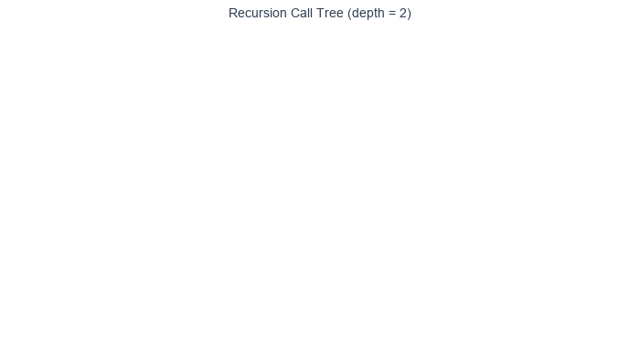
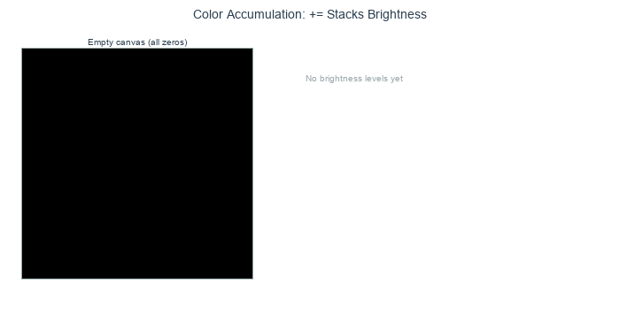
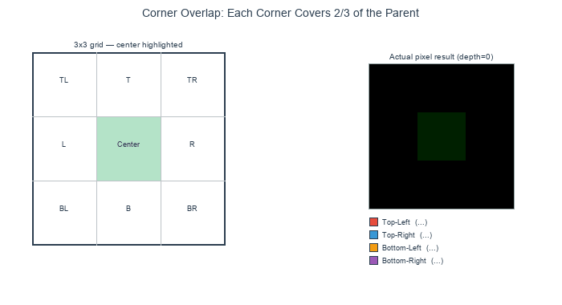

.. _module-4-1-1-fractal-square:

================================
4.1.1 Fractal Square
================================

:Duration: 20-25 minutes
:Level: Beginner-Intermediate

Overview
========

One function. Four recursive calls per level. The result: an 800x800 canvas filled with nested green squares that brighten where they overlap. In this exercise, you will build that function from scratch using recursive square subdivision, where each square spawns four smaller copies of itself in its corners.

The fractal square is a direct introduction to writing recursive functions. The same technique, a function calling itself with shrinking parameters, underpins the Mandelbrot set, L-systems, and procedural terrain generation. By the end, you will have a working recursive algorithm and a visual proof that 15 lines of logic can fill a canvas with structure at every scale.

Learning Objectives
-------------------

By the end of this exercise, you will be able to:

* Understand recursive function structure with base cases and recursive cases
* Apply divide-and-conquer strategy to generate fractal patterns
* Visualize how recursion depth affects pattern complexity
* Create variations of fractal patterns by modifying recursion parameters

Quick Start: See It In Action
=============================

Run this code and a pattern of nested green squares appears. Zoom into any corner and the same structure recurs. This is the fractal square: four recursive calls, a center fill, and nothing else.

.. code-block:: python
   :caption: fractal_square.py
   :linenos:

   import numpy as np
   from PIL import Image

   def draw_fractal_square(canvas, x_min, x_max, y_min, y_max, depth):
       # Divide the region into a 3x3 grid
       x_third = (x_max - x_min) // 3
       y_third = (y_max - y_min) // 3

       # Locate the center square within the grid
       center_x_start = x_min + x_third
       center_x_end = x_min + 2 * x_third
       center_y_start = y_min + y_third
       center_y_end = y_min + 2 * y_third

       # Fill the center square with green (+32 per recursion level)
       canvas[center_y_start:center_y_end, center_x_start:center_x_end, 1] += 32

       # Recurse into the four corner regions until depth reaches 0
       if depth > 0:
           draw_fractal_square(canvas, x_min, center_x_end, y_min, center_y_end, depth - 1)
           draw_fractal_square(canvas, center_x_start, x_max, y_min, center_y_end, depth - 1)
           draw_fractal_square(canvas, x_min, center_x_end, center_y_start, y_max, depth - 1)
           draw_fractal_square(canvas, center_x_start, x_max, center_y_start, y_max, depth - 1)

   # Create an 800x800 black canvas (3 channels for RGB)
   canvas = np.zeros((800, 800, 3), dtype=np.uint8)

   # Generate fractal with depth=3 (produces 4 levels of detail)
   draw_fractal_square(canvas, 0, 800, 0, 800, 3)

   # Save the result as a PNG image
   image = Image.fromarray(canvas)
   image.save("quickstart_fractal.png")

.. figure:: visuals/fractal_square.png
   :width: 500px
   :align: center
   :alt: Fractal square pattern showing nested green squares with increasing brightness at intersections

   Fractal square pattern generated with depth=3, producing 4 levels of detail.

.. dropdown:: Function Reference: ``np.zeros`` and ``Image.fromarray``
   :class: note

   **np.zeros(shape, dtype)**
      Creates a new array filled entirely with zeros. The ``shape`` parameter
      defines the dimensions: ``(800, 800, 3)`` means 800 rows, 800 columns,
      and 3 color channels (RGB). The ``dtype=np.uint8`` stores each value as
      an unsigned 8-bit integer (range 0 to 255), matching the standard range
      for image pixel values.

   **Image.fromarray(array)**
      A PIL/Pillow function that converts a NumPy array into an Image object,
      which can then be saved as PNG, JPEG, or other formats.

The pattern emerges by applying a simple rule repeatedly. Divide a region into nine parts, fill the center, then repeat the process on the four corners. Each iteration quadruples the square count, building the nested pattern visible in the output above.

Core Concepts
=============

Core Concept 1: What Are Fractals?
-----------------------------------

A **fractal** is a geometric shape that exhibits self-similarity at different scales. When you zoom into a fractal, you see smaller copies of the same pattern repeating indefinitely [Mandelbrot1982]_. This property makes fractals fundamentally different from ordinary geometric shapes like circles or triangles.

Fractals appear throughout nature in surprisingly diverse forms:

* **Fern leaves**: Each leaflet resembles the whole fern
* **Coastlines**: Bays contain smaller bays, which contain even smaller bays
* **Lightning bolts**: Branches split into smaller branches
* **Snowflakes**: Six-fold symmetry repeats at microscopic levels [Mandelbrot1982]_

The mathematical study of fractals began with Benoit Mandelbrot's groundbreaking work in 1975 [Mandelbrot1982]_. He coined the term "fractal" from the Latin word *fractus*, meaning broken or fragmented. Fractals occupy a fractional dimension between traditional geometric dimensions. Michael Barnsley [Barnsley1988]_ later developed the Iterated Function System (IFS) approach for generating fractals. Peitgen and Richter [Peitgen1986]_ popularized fractal art through their visualizations.

Core Concept 2: Recursion Fundamentals
---------------------------------------

Look at ``draw_fractal_square`` in the Quick Start code. It calls itself four times inside its own body. That is **recursion**: a function solving a problem by calling itself on a smaller piece of the same problem [Cormen2009]_. Most recursive algorithms share two components:

1. **Base Case**: The condition that stops the recursion
2. **Recursive Case**: The part where the function calls itself with modified parameters

Consider our fractal square algorithm:

.. code-block:: python
   :caption: Anatomy of a recursive function
   :linenos:
   :emphasize-lines: 12,15,17-20

   def draw_fractal_square(canvas, x_min, x_max, y_min, y_max, depth):
       # Divide the region into a 3x3 grid
       x_third = (x_max - x_min) // 3
       y_third = (y_max - y_min) // 3

       # Locate the center square within the grid
       center_x_start = x_min + x_third
       center_x_end = x_min + 2 * x_third
       center_y_start = y_min + y_third
       center_y_end = y_min + 2 * y_third

       # Fill the center square with green (+32 per layer)
       canvas[center_y_start:center_y_end, center_x_start:center_x_end, 1] += 32

       # Base case: stop when depth reaches 0
       if depth > 0:
           # Recursive case: apply the same process to each corner
           draw_fractal_square(canvas, x_min, center_x_end, y_min, center_y_end, depth - 1)
           draw_fractal_square(canvas, center_x_start, x_max, y_min, center_y_end, depth - 1)
           draw_fractal_square(canvas, x_min, center_x_end, center_y_start, y_max, depth - 1)
           draw_fractal_square(canvas, center_x_start, x_max, center_y_start, y_max, depth - 1)

* **Line 12**: Fill the center square (the action performed at each level)
* **Line 15**: Base case check using the ``depth`` parameter
* **Lines 17-20**: Four recursive calls, one for each corner region

The ``depth`` parameter acts as a countdown. Each recursive call decrements it by one, and when it reaches zero, the function stops calling itself. This prevents infinite recursion and allows you to control the level of detail in the final image.

   The recursion call tree for depth=2. Each node is one function call; the depth parameter counts down until the base case (depth=0) stops further branching. *Diagram generated with Claude - Opus 4.5*

Core Concept 3: The Fractal Square Algorithm
---------------------------------------------

The fractal square algorithm follows a divide-and-conquer strategy [Cormen2009]_. The diagram below shows the full spatial pattern: each region is divided into a 3x3 grid, the center cell is filled, and the process recurses on each corner.

.. figure:: visuals/recursion_diagram.png
   :width: 600px
   :align: center
   :alt: Diagram showing how the canvas is divided into a 3x3 grid with the center filled and corners recursively processed

   Fractal square recursive division pattern. The canvas is divided into a 3x3 grid, the center is filled, and the process repeats on each corner. Diagram generated with Claude - Opus 4.5.

The following three steps break this process down in detail.

**Step 1: Divide the Region**

The current region is divided into a 3x3 grid of nine equal rectangles. This is accomplished by calculating the boundaries at one-third and two-thirds of the width and height:

.. code-block:: python
   :caption: Grid division calculation

   # Calculate one-third of the region dimensions
   x_third = (x_max - x_min) // 3
   y_third = (y_max - y_min) // 3

   # The center square starts at one-third and ends at two-thirds
   center_x_start = x_min + x_third
   center_x_end = x_min + 2 * x_third
   center_y_start = y_min + y_third
   center_y_end = y_min + 2 * y_third

.. dropdown:: Function Reference: ``//`` (integer division)
   :class: note

   **//** **operator (integer division)**
      Floor division that discards the remainder and returns a whole number.
      Essential for calculating pixel coordinates, which must be integers.
      For example, ``800 // 3`` gives ``266``, not ``266.667``.

**Step 2: Fill the Center**

The center rectangle is filled with color. We use the ``+=`` operator instead of ``=`` to create an accumulation effect. Overlapping regions become brighter because color values stack.

.. code-block:: python
   :caption: Color accumulation for depth visualization

   # Add 32 to the green channel (index 1) of every pixel in the center
   # Using += means overlapping regions get brighter with each layer
   canvas[center_y_start:center_y_end, center_x_start:center_x_end, 1] += 32

.. dropdown:: Function Reference: Array slicing and ``+=`` accumulation
   :class: note

   **Array slicing: canvas[y1:y2, x1:x2, channel]**
      NumPy arrays use bracket notation to select sub-regions. The first index
      selects rows (vertical), the second selects columns (horizontal), and the
      third selects the color channel (0=Red, 1=Green, 2=Blue). The slice
      ``y1:y2`` includes rows from ``y1`` up to (but not including) ``y2``.

   **+= on array slices (in-place addition)**
      The ``+=`` operator adds a value to every element in the selected region
      simultaneously. When applied to overlapping regions across recursion
      levels, color values accumulate, making overlapping areas brighter.

The value ``32`` is added to the green channel (index 1) of each pixel in the center rectangle. Areas filled by multiple recursion levels accumulate more color, revealing the recursive structure visually. The final NumPy array is converted to an image using Pillow [PillowDocs]_.

   Color accumulation across four recursion levels. Each level adds 32 to the green channel; where regions overlap, brightness stacks up to 224 (seven overlaps). *Diagram generated with Claude - Opus 4.5*

**Step 3: Recurse on Corners**

The algorithm then calls itself on each of the four corner regions. Because these regions overlap with the center, the nested square pattern emerges.

* **Top-left corner**: from ``(x_min, y_min)`` to ``(center_x_end, center_y_end)``
* **Top-right corner**: from ``(center_x_start, y_min)`` to ``(x_max, center_y_end)``
* **Bottom-left corner**: from ``(x_min, center_y_start)`` to ``(center_x_end, y_max)``
* **Bottom-right corner**: from ``(center_x_start, center_y_start)`` to ``(x_max, y_max)``

.. figure:: visuals/fractal_square_frames.gif
   :width: 500px
   :align: center
   :alt: Animation showing the fractal square being built frame by frame, with each recursion level adding smaller nested squares

   Step-by-step construction of the fractal across recursion levels.

.. important::

   The corner regions overlap with the center. This overlap is intentional and is what produces the nesting you see in the output. Each corner contains two-thirds of the parent region in each dimension, not just one-third.

   Each corner covers two-thirds of the parent region in both dimensions, creating up to five overlapping layers at the center cell. *Diagram generated with Claude - Opus 4.5*

Hands-On Exercises
==================

Now it is time to apply what you've learned with three progressively challenging exercises. Each builds on the previous one using the **Execute → Modify → Create** approach [Sweller1985]_, [Mayer2020]_.

Exercise 1: Execute and Explore
-------------------------------

Run the script ``exercise1_execute.py`` and observe the output:

.. code-block:: bash

   python exercise1_execute.py

After running the code, answer these reflection questions:

1. How many distinct brightness levels can you count in the image?
2. Why do some areas appear brighter than others?
3. What would happen if you changed the depth from 3 to 0? What about 5?

.. dropdown:: Answers and Explanation
   :class-title: sd-font-weight-bold

   1. **Brightness levels**: You should observe 4 distinct brightness levels corresponding to depths 0 through 4. The brightest areas are where all four recursion levels overlap.

   2. **Brightness variation**: Areas where multiple recursion levels overlap accumulate color. The center of the image has the most overlaps because it falls within the center region of all recursion levels. Each overlap adds 32 to the green channel, so maximum brightness areas have been filled 4 times (32 x 4 = 128).

   3. **Depth changes**: At depth 0, you would see only a single center square. At depth 5, the pattern becomes extremely dense with fine detail. The number of center squares filled at depth ``n`` follows the formula ``(4^(n+1) - 1) / 3``. At depth 3, this equals 85 filled squares (though many overlap).

Exercise 2: Modify Parameters
-----------------------------

Open ``exercise2_modify.py`` and change the CONFIG values at the top of the script. Re-run the script after each change to see how the fractal responds.

.. code-block:: python
   :caption: exercise2_modify.py: CONFIG section

   # =============================================
   # CONFIGURATION: Modify these values
   # =============================================
   RECURSION_DEPTH = 3     # How many levels of detail (try 0, 1, 2, 3, 4, 5)
   COLOR_CHANNEL = 1       # Which RGB channel: 0=Red, 1=Green, 2=Blue
   COLOR_INCREMENT = 32    # Brightness added per level (try 16, 32, 64)
   CANVAS_SIZE = 800       # Image dimensions in pixels
   # =============================================

**Goal 1**: Change ``RECURSION_DEPTH`` to explore detail levels

Set ``RECURSION_DEPTH`` to ``0``, then ``1``, then ``5``. Run the script each time.

.. dropdown:: Goal 1: What to expect
   :class-title: sd-font-weight-bold

   * **Depth 0**: A single green square in the center of the canvas. No recursion occurs.
   * **Depth 1**: The center square plus four smaller squares in the corners, the first level of self-similarity.
   * **Depth 5**: An extremely dense pattern where individual squares are barely visible. The brightest areas reach green value 192 (6 overlapping levels x 32).

   .. list-table::
      :widths: 33 33 33

      * - .. figure:: visuals/exercise2_depth_0.png
             :width: 100%
             :alt: Depth 0

             Depth 0

        - .. figure:: visuals/exercise2_depth_3.png
             :width: 100%
             :alt: Depth 3

             Depth 3

        - .. figure:: visuals/exercise2_depth_5.png
             :width: 100%
             :alt: Depth 5

             Depth 5

**Goal 2**: Change ``COLOR_CHANNEL`` to make a red or blue fractal

Set ``COLOR_CHANNEL`` to ``0`` (red) or ``2`` (blue) and re-run.

.. dropdown:: Goal 2: What to expect
   :class-title: sd-font-weight-bold

   The fractal structure is identical; only the color changes. Channel ``0`` produces a red fractal, channel ``1`` produces green (the default), and channel ``2`` produces blue. This demonstrates that each RGB channel is an independent layer of brightness values.

**Goal 3**: Change ``COLOR_INCREMENT`` to adjust contrast

Try ``COLOR_INCREMENT = 16`` for a subtle, dark pattern, and ``COLOR_INCREMENT = 64`` for bright, high-contrast output.

.. dropdown:: Goal 3: What to expect
   :class-title: sd-font-weight-bold

   * **Increment 16**: The pattern is darker and subtler. Overlapping areas are harder to distinguish because the brightness difference between levels is small.
   * **Increment 64**: The pattern is bright and high-contrast. However, with higher depths, overlapping areas may exceed 255 and wrap around to 0 (producing unexpected dark spots). This is called **integer overflow**, an important consideration when working with ``uint8`` arrays.

Exercise 3: Create Your Own Fractal
-----------------------------------

Open ``exercise3_create.py`` and complete the four TODOs to make the fractal work. The center-fill step is done for you. Your task is to add the four recursive calls that process each corner.

**What you need to know**: Each corner covers two-thirds of the parent region in both dimensions. The corners overlap with the center square, which is what creates the nested pattern.

.. code-block:: bash

   python exercise3_create.py

Without the TODOs filled in, you will only see a single center square. Once your recursive calls are correct, the full fractal pattern will appear.

.. dropdown:: Hint 1: Think about the grid
   :class-title: sd-font-weight-bold

   Draw a 3x3 grid on paper. The center cell is already filled. Each corner region extends from one edge to the two-thirds mark in both dimensions, so each corner covers a 2x2 block of the 3x3 grid.

   Think of the top-left corner: it includes cells (0,0), (0,1), (1,0), and (1,1) of the grid.

.. dropdown:: Hint 2: First corner completed
   :class-title: sd-font-weight-bold

   Here is the top-left corner call:

   .. code-block:: python

      # Top-left corner
      fractal_square(canvas, x_min, center_x_end, y_min, center_y_end, depth - 1)

   The pattern is: ``fractal_square(canvas, x_start, x_end, y_start, y_end, depth - 1)``

   For the top-right corner, the x range shifts to the right side. What values would replace ``x_min`` and ``center_x_end``?

.. dropdown:: Hint 3: Three of four corners
   :class-title: sd-font-weight-bold

   .. code-block:: python

      # Top-left corner
      fractal_square(canvas, x_min, center_x_end, y_min, center_y_end, depth - 1)
      # Top-right corner
      fractal_square(canvas, center_x_start, x_max, y_min, center_y_end, depth - 1)
      # Bottom-left corner
      fractal_square(canvas, x_min, center_x_end, center_y_start, y_max, depth - 1)

   The bottom-right corner combines the right x range with the bottom y range. Fill in the last call.

.. dropdown:: Complete Solution
   :class-title: sd-font-weight-bold

   .. code-block:: python
      :linenos:
      :emphasize-lines: 14-17

      def fractal_square(canvas, x_min, x_max, y_min, y_max, depth):
          center_x_start = x_min + (x_max - x_min) // 3
          center_x_end = x_min + (x_max - x_min) * 2 // 3
          center_y_start = y_min + (y_max - y_min) // 3
          center_y_end = y_min + (y_max - y_min) * 2 // 3

          canvas[center_y_start:center_y_end, center_x_start:center_x_end, COLOR_CHANNEL] += COLOR_INCREMENT

          if depth > 0:
              fractal_square(canvas, x_min, center_x_end, y_min, center_y_end, depth - 1)        # Top-left
              fractal_square(canvas, center_x_start, x_max, y_min, center_y_end, depth - 1)      # Top-right
              fractal_square(canvas, x_min, center_x_end, center_y_start, y_max, depth - 1)      # Bottom-left
              fractal_square(canvas, center_x_start, x_max, center_y_start, y_max, depth - 1)    # Bottom-right

Make It Your Own
^^^^^^^^^^^^^^^^

Once your fractal works, try the experiments listed at the bottom of ``exercise3_create.py``:

* Change ``RECURSION_DEPTH`` to 5 for dense detail
* Set ``COLOR_CHANNEL`` to 0 for a red fractal
* Comment out two of your corner calls and see what asymmetric pattern appears?

.. dropdown:: Function Reference: ``np.minimum``
   :class: note

   **np.minimum(a, b)**
      Returns the element-wise minimum of two arrays or values. Used to clamp
      color values at 255, preventing overflow. For example,
      ``np.minimum(canvas[...] + 64, 255)`` ensures no pixel exceeds the
      maximum brightness.

**Challenge Extension**: Modify the color based on the recursion depth. Use the depth value to create a gradient effect where deeper recursion levels have different colors.

.. dropdown:: Challenge Solution
   :class-title: sd-font-weight-bold

   .. code-block:: python

      def square_with_depth_color(canvas, x_min, x_max, y_min, y_max, depth, max_depth):
          # Calculate grid division points
          center_x_start = x_min + (x_max - x_min) // 3
          center_x_end = x_min + (x_max - x_min) * 2 // 3
          center_y_start = y_min + (y_max - y_min) // 3
          center_y_end = y_min + (y_max - y_min) * 2 // 3

          # Map current recursion level to a color
          # level=0 at the top, level=max_depth at the deepest
          level = max_depth - depth
          red = 32 * level            # Red increases with depth
          green = 255 - 32 * level    # Green decreases with depth
          blue = 128                  # Blue stays constant

          # Fill center with depth-based color, clamping to 255 maximum
          canvas[center_y_start:center_y_end, center_x_start:center_x_end, 0] = np.minimum(canvas[center_y_start:center_y_end, center_x_start:center_x_end, 0] + red, 255)
          canvas[center_y_start:center_y_end, center_x_start:center_x_end, 1] = np.minimum(canvas[center_y_start:center_y_end, center_x_start:center_x_end, 1] + green, 255)
          canvas[center_y_start:center_y_end, center_x_start:center_x_end, 2] = np.minimum(canvas[center_y_start:center_y_end, center_x_start:center_x_end, 2] + blue, 255)

          if depth > 0:
              # Recurse into each corner with decremented depth
              square_with_depth_color(canvas, x_min, center_x_end, y_min, center_y_end, depth - 1, max_depth)
              square_with_depth_color(canvas, x_min, center_x_end, center_y_start, y_max, depth - 1, max_depth)
              square_with_depth_color(canvas, center_x_start, x_max, y_min, center_y_end, depth - 1, max_depth)
              square_with_depth_color(canvas, center_x_start, x_max, center_y_start, y_max, depth - 1, max_depth)

   .. figure:: visuals/challenge_output.png
      :width: 400px
      :align: center
      :alt: Fractal square with depth-based color gradient showing red increasing and green decreasing with depth

      Fractal square with depth-based color gradient.

.. note:: Implementation Note

   The fractal square implementations in this module are inspired by classical
   fractal geometry references:

   - Mandelbrot, B.B. (1982). *The Fractal Geometry of Nature*, W.H. Freeman. Covers self-similar fractals and fractional dimensions
   - Barnsley, M.F. (1988). *Fractals Everywhere*, Academic Press. Covers Iterated Function Systems for fractal generation
   - Peitgen, H.-O. & Richter, P.H. (1986). *The Beauty of Fractals*, Springer-Verlag. Covers visual fractal construction techniques
   - Peitgen, H.-O., Jurgens, H. & Saupe, D. (1992). *Fractals for the Classroom*, Springer/NCTM. Covers educational fractal exercises [Peitgen1992]_

Summary
=======

This exercise showed that 15 lines of recursive logic can fill an 800x800 canvas with a fractal pattern. Here is what to remember:

* A function that calls itself on smaller inputs is **recursive**. The ``depth`` parameter stops it from running forever.
* The fractal square divides each region into a 3x3 grid, fills the center, and recurses on the four corners. Those corners overlap, which is why the output shows a nested structure.
* Using ``+=`` instead of ``=`` makes overlapping regions brighter, so the recursive layering becomes visible in the image.
* Forgetting the base case, exceeding 255 in a color channel, or sizing corners at 1/3 instead of 2/3 are the three mistakes most likely to break your output.

References
==========

.. [Mandelbrot1982] Mandelbrot, B. B. (1982). *The Fractal Geometry of Nature*. W. H. Freeman and Company. ISBN: 978-0-7167-1186-5

.. [Barnsley1988] Barnsley, M. F. (1988). *Fractals Everywhere*. Academic Press. ISBN: 978-0-12-079062-9

.. [Peitgen1986] Peitgen, H.-O., & Richter, P. H. (1986). *The Beauty of Fractals: Images of Complex Dynamical Systems*. Springer-Verlag. ISBN: 978-3-540-15851-6

.. [Peitgen1992] Peitgen, H.-O., Jürgens, H., & Saupe, D. (1992). *Fractals for the Classroom: Part One - Introduction to Fractals and Chaos*. Springer-Verlag. ISBN: 978-0-387-97041-8

.. [Cormen2009] Cormen, T. H., Leiserson, C. E., Rivest, R. L., & Stein, C. (2009). *Introduction to Algorithms* (3rd ed.). MIT Press. ISBN: 978-0-262-03384-8

.. [PillowDocs] Clark, A., et al. (2024). *Pillow: Python Imaging Library*. Python Software Foundation. https://pillow.readthedocs.io/

.. [Sweller1985] Sweller, J. (1985). Optimizing cognitive load in instructional design. *Instructional Science*, 14(3), 195-218.

.. [Mayer2020] Mayer, R. E. (2020). *Multimedia Learning* (3rd ed.). Cambridge University Press. ISBN: 978-1-316-63896-8
