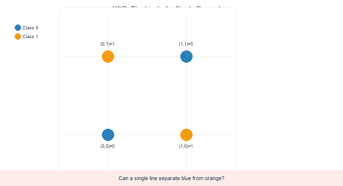
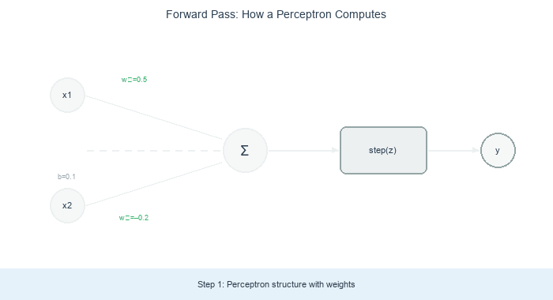
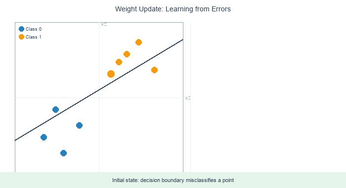
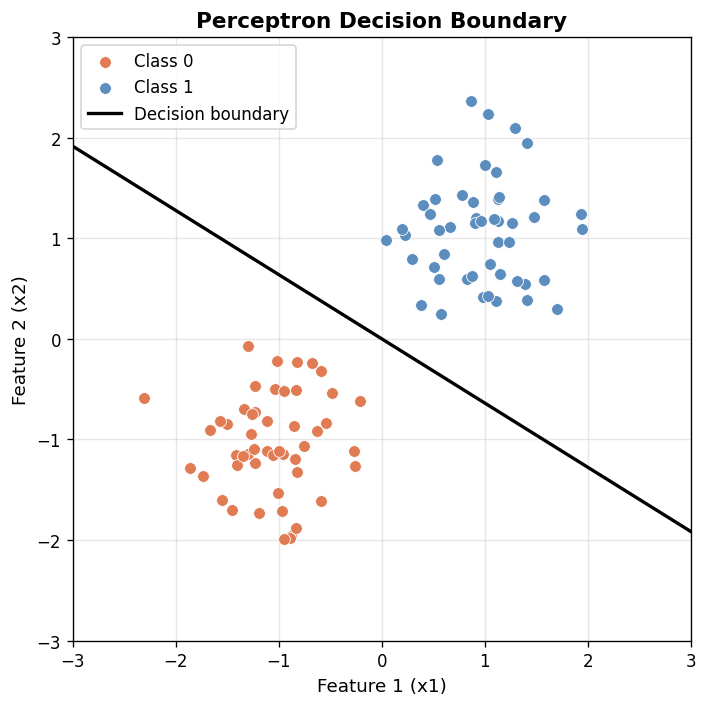
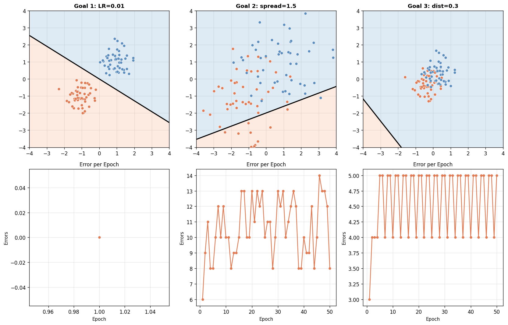

.. _module-9-1-1-perceptron-scratch:

================================
9.1.1 Perceptron from Scratch
================================

:Duration: 35-40 minutes
:Level: Intermediate

Overview
========

Rosenblatt built the first perceptron in 1958 using three operations: multiply inputs by weights, sum the products, and check if the result crosses a threshold [LeCun2015a]_. We will build a working binary classifier in about 30 lines of NumPy. No frameworks, no hidden magic.

Frank Rosenblatt introduced the perceptron in 1958 as a trainable binary classifier [Rosenblatt1958]_. It was the first machine that could learn to classify data [Crevier1993]_. The same weight-update rule still runs inside networks with billions of parameters today. When you write the weight update yourself, you see exactly where learning happens: right after each wrong prediction.

Learning Objectives
-------------------

By the end of this exercise, you will be able to:

* Understand perceptron architecture with inputs, weights, bias, and activation
* Implement the forward pass to compute predictions from inputs
* Apply the perceptron learning rule to update weights based on errors
* Visualize decision boundaries learned by the perceptron

Quick Start: See It In Action
=============================

Download and run the script to train a perceptron and visualize its learned decision boundary:

:download:`Download simple_perceptron.py <simple_perceptron.py>`

.. code-block:: bash

   python simple_perceptron.py

.. figure:: visuals/perceptron_output.png
   :width: 450px
   :align: center
   :alt: Decision boundary learned by perceptron showing blue and orange regions separated by a line, with data points colored by class

   The trained perceptron divides the feature space into two regions.

The perceptron learns by adjusting its weights whenever it makes an error. After training, the weights define a linear boundary that separates the two classes. If a straight line can separate the two classes, this learning rule will find it. Novikoff proved that in 1962.

Core Concepts
=============

Core Concept 1: What is a Perceptron?
--------------------------------------

Imagine taking two numbers, multiplying each by a weight, adding them up with a bias term, and checking whether the total is positive or negative. That check decides the output: 1 or 0. This is what a **perceptron** does. Rosenblatt based it on McCulloch and Pitts's 1943 threshold logic unit [McCulloch1943]_: a mathematical node that sums weighted input signals and fires (outputs 1) only when the total exceeds a fixed threshold.

In practice, the perceptron takes an array of numerical inputs, multiplies each by a learned weight, and sums the products with a bias term. A step function converts that sum into a binary output: 1 if the sum is non-negative, 0 otherwise. Mathematically:

.. code-block:: text

   output = step(w1*x1 + w2*x2 + ... + wn*xn + b)

Where:

* **x1, x2, ..., xn** are the input features
* **w1, w2, ..., wn** are the weights (learned from data)
* **b** is the bias term (also learned)
* **step(z)** is the step function: returns 1 if z >= 0, else 0

.. figure:: visuals/perceptron_architecture.png
   :width: 550px
   :align: center
   :alt: Diagram showing perceptron architecture with input nodes x1 and x2, weights w1 and w2, summation node, step activation, and output y

   Perceptron architecture: inputs, weights, summation, and step activation. Diagram generated with Claude - Opus 4.5.

The weights determine how much each input contributes to the output. A large positive weight means that input strongly influences the output toward 1, while a large negative weight pushes it toward 0. The bias acts like a threshold, shifting when the perceptron fires.

.. admonition:: Historical Context:

   In 1969, Minsky and Papert proved that a single perceptron cannot learn the XOR function [Minsky1969]_. This limitation contributed to the first "AI winter" when funding for neural network research dried up [Crevier1993]_. It took multi-layer networks (with hidden layers) to overcome this limitation, but those required new training algorithms like backpropagation.

   No single line can separate XOR. The boundary tries every angle but always misclassifies at least one point. *Diagram generated with Claude - Opus 4.5.*

Core Concept 2: The Forward Pass
---------------------------------

Feed an input into the perceptron and it returns 0 or 1. That computation is the **forward pass**: multiply each input by its weight, add the bias, and check whether the sum is positive or negative.

.. code-block:: python
   :caption: Forward pass implementation
   :linenos:
   :emphasize-lines: 6,9

   def forward(self, x):
       """
       Compute the perceptron output for input x.
       """
       # Step 1: Compute weighted sum (dot product + bias)
       # Formula: z = w1*x1 + w2*x2 + ... + wn*xn + bias
       weighted_sum = np.dot(self.weights, x) + self.bias

       # Step 2: Apply step activation function
       if weighted_sum >= 0:
           return 1
       else:
           return 0

**Line 6** computes the weighted sum using NumPy's dot product [NumPyDocs911]_. This is the linear combination of inputs and weights: w1*x1 + w2*x2 + ... + b.

**Line 9** applies the step function. If the weighted sum is non-negative, the perceptron outputs 1 (predicts Class 1). Otherwise, it outputs 0 (predicts Class 0).

The forward pass is essentially drawing a line through the feature space. Points on one side of the line are Class 0; points on the other side are Class 1. The weights determine the slope of this line, and the bias determines where it crosses.

   A forward pass with concrete numbers: inputs (0.7, 0.3) multiply by weights, sum with bias to get 0.39, and the step function outputs 1. *Diagram generated with Claude - Opus 4.5.*

.. figure:: visuals/linearly_separable.png
   :width: 400px
   :align: center
   :alt: Scatter plot showing two clusters of points, orange in lower-left and blue in upper-right, that can be separated by a straight line

   Two clusters separable by a straight line.

Core Concept 3: Learning from Errors
-------------------------------------

When the perceptron predicts incorrectly, it adjusts its weights. Rosenblatt formalized this correction as the **perceptron learning rule** [Rosenblatt1958]_: if the prediction is wrong, nudge the weights to make it less wrong next time.

.. code-block:: python
   :caption: Perceptron learning rule
   :linenos:
   :emphasize-lines: 10,11

   def train(self, X, y, epochs=100):
       for epoch in range(epochs):
           for i in range(len(X)):
               # Make prediction
               y_pred = self.forward(X[i])

               # Calculate error
               error = y[i] - y_pred  # +1, 0, or -1

               # Update if wrong
               if error != 0:
                   self.weights = self.weights + self.learning_rate * error * X[i]
                   self.bias = self.bias + self.learning_rate * error

The learning rule states:

* **If prediction is correct** (error = 0): do nothing
* **If predicted 0 but should be 1** (error = +1): increase weights in direction of input
* **If predicted 1 but should be 0** (error = -1): decrease weights in direction of input

   One weight update step: the perceptron misclassifies a point, computes error, adjusts weights, and the boundary shifts to fix the mistake. *Diagram generated with Claude - Opus 4.5.*

The **learning rate** controls how much the weights change on each update. A larger learning rate means bigger steps (faster learning but potentially unstable), while a smaller rate means smaller, more cautious updates.

.. figure:: visuals/training_progression.gif
   :width: 400px
   :align: center
   :alt: Animation showing decision boundary rotating and shifting as the perceptron trains over multiple epochs

   Watch the decision boundary evolve during training. Initially random, it gradually rotates to separate the two classes correctly.

.. figure:: visuals/concept3_comparison.png
   :width: 700px
   :align: center
   :alt: Side-by-side comparison showing best decision boundary on left and training error progression chart on right

   Best decision boundary (left) and error over epochs (right).

.. admonition:: Why Does the Error Oscillate?
   :class: note

   You may notice the error count fluctuates rather than decreasing smoothly. This is a fundamental property of the basic perceptron algorithm:

   1. **Online Learning**: The perceptron updates weights after each misclassified point, not after seeing all data. Fixing one point may break another.

   2. **Perceptron Cycling Theorem**: When data is **not** linearly separable (as with our deliberate outliers), the perceptron will eventually cycle through the same weight configurations forever [Block1962]_. It cannot converge because no single line can correctly classify all points.

   3. **No Memory of Best Solution**: The basic perceptron does not track which weights performed best. It simply keeps updating.

   This limitation led to the **Pocket Algorithm** [Gallant1990]_, which keeps the best-performing weights "in its pocket" while continuing to train. Modern neural networks address this through batch learning, early stopping, and saving model checkpoints.

**Convergence Theorem**: If the data is linearly separable, the perceptron learning rule is guaranteed to find a separating boundary in a finite number of steps [Haykin2009]_. This result, formally proven by Albert Novikoff in 1962, was one of the first convergence proofs in machine learning [Novikoff1963]_.

Hands-On Exercises
==================

Now it is time to apply what you have learned with three progressively challenging exercises. Each builds on the previous one using the **Execute → Modify → Create** approach [Sweller1985]_, [Mayer2020]_.

Exercise 1: Execute and Explore
-------------------------------

Download and run the script to train a perceptron and visualize its decision boundary.

:download:`Download exercise1_execute.py <exercise1_execute.py>`

.. code-block:: bash

   python exercise1_execute.py

   The perceptron learns a straight line that separates orange (Class 0) from blue (Class 1) points.

After observing the output, answer these reflection questions:

1. How many epochs did it take to converge (reach zero errors)?
2. Look at the decision boundary line , what do the weights and bias determine about its position?
3. Do all orange points fall on one side of the line and all blue points on the other?

.. dropdown:: Answers and Explanation
   :class-title: sd-font-weight-bold

   1. **Epochs to converge**: With seed 42 and this well-separated data, the perceptron typically converges in 1-2 epochs. The clusters are far apart, so even near-zero initial weights classify most points correctly.

   2. **Geometric interpretation**: The weights [w1, w2] define the normal vector to the decision boundary line. The equation w1*x1 + w2*x2 + b = 0 describes a line in 2D space. Points where this sum is positive are Class 1; points where it is negative are Class 0. The bias shifts the line away from the origin.

   3. **Separation**: Yes, because the data is linearly separable (the two clusters do not overlap), the perceptron finds a line that perfectly separates them. The convergence theorem [Novikoff1963]_ guarantees this will happen in a finite number of steps.

.. dropdown:: NumPy Functions Used
   :class-title: sd-font-weight-bold

   ``np.random.seed(n)``
      Lock the random number generator so every run produces identical results. Useful for debugging and reproducibility.

   ``np.random.randn(rows, cols)``
      Draw random numbers from a standard normal distribution (bell curve with mean 0, standard deviation 1). Multiply by a constant to scale.

   ``np.dot(a, b)``
      Dot product: multiply corresponding elements and sum them. For vectors a=[a1, a2] and b=[b1, b2], returns a1*b1 + a2*b2.

   ``np.vstack([a, b])``
      Stack arrays vertically (row-wise). Combines two arrays with shape (50, 2) into one array with shape (100, 2).

   ``np.array([...])``
      Create a NumPy array from a Python list. Enables fast element-wise math operations.

   ``np.linspace(start, stop, n)``
      Create n evenly spaced values between start and stop. Used here to draw the decision boundary line across the plot.

Exercise 2: Modify Parameters
-----------------------------

Experiment with the CONFIG values to see how learning rate and data difficulty affect the perceptron.

:download:`Download exercise2_modify.py <exercise2_modify.py>`

.. code-block:: bash

   python exercise2_modify.py

The script generates a two-panel image: the decision boundary on the left and the error-per-epoch curve on the right. Each time you change CONFIG values and re-run, both panels update.

**Goal 1**: Slow down learning

Change ``LEARNING_RATE`` from ``0.1`` to ``0.01``. Run the script and compare the error curve.

.. dropdown:: What to expect
   :class-title: sd-font-weight-bold

   With a smaller learning rate, each weight update is more cautious. For this well-separated data the perceptron still converges quickly (1-2 epochs), but the weights are smaller in magnitude. With harder data (see Goals 2-3), the difference becomes more visible.

**Goal 2**: Make the clusters overlap

Change ``CLUSTER_SPREAD`` from ``0.5`` to ``1.5`` (keep other values at their defaults). This widens each cluster so they overlap in the middle.

.. dropdown:: What to expect
   :class-title: sd-font-weight-bold

   When clusters overlap, the data is no longer linearly separable , no single straight line can classify every point correctly. The perceptron trains for all 50 epochs without converging, and the error curve oscillates between 3-6 misclassified points. This is the fundamental limitation that Minsky and Papert identified [Minsky1969]_.

**Goal 3**: Push clusters almost together

Change ``CLUSTER_DISTANCE`` from ``1.0`` to ``0.3`` (reset ``CLUSTER_SPREAD`` to ``0.5``). The two cluster centers are now only 0.6 apart instead of 2.0.

.. dropdown:: What to expect
   :class-title: sd-font-weight-bold

   The clusters are so close that their edges overlap. The perceptron oscillates: fixing one misclassified point breaks another. The error curve shows a characteristic zigzag pattern , this is the **Perceptron Cycling Theorem** [Block1962]_ in action. The boundary keeps shifting back and forth without settling.

   Expected results for each goal. Left: slow learning rate. Center: overlapping clusters. Right: clusters almost touching.

.. dropdown:: NumPy Functions Used
   :class-title: sd-font-weight-bold

   ``np.meshgrid(x, y)``
      Create 2-D coordinate grids from two 1-D arrays. Returns two arrays: one with x-values repeated across rows, one with y-values repeated down columns. Used to classify every pixel in the plot and shade the background.

   ``array.reshape(shape)``
      Change the shape of an array without copying data. ``reshape(-1)`` flattens to 1-D; ``reshape(rows, cols)`` restores a 2-D grid.

Exercise 3: Create Your Own
---------------------------

Complete the starter code to build a working perceptron from scratch. The data generation, training loop structure, and visualization are all provided , you fill in the three core algorithm pieces.

:download:`Download exercise3_create.py <exercise3_create.py>`

**Your tasks**:

1. **TODO 1** — Initialize weights, bias, and learning rate in ``__init__``
2. **TODO 2** — Compute the weighted sum and apply the step function in ``forward``
3. **TODO 3** — Predict, compute error, and update weights in the training loop

.. dropdown:: Hint 1: Initialization
   :class-title: sd-font-weight-bold

   For ``__init__``, set three attributes:

   * ``self.weights`` — use ``np.random.randn(input_size) * 0.01`` to start with small random values
   * ``self.bias`` — set to ``0.0``
   * ``self.learning_rate`` — store the ``learning_rate`` argument

.. dropdown:: Hint 2: Forward Pass
   :class-title: sd-font-weight-bold

   For ``forward``, two steps:

   .. code-block:: python

      # Step A: compute the weighted sum
      weighted_sum = np.dot(self.weights, x) + self.bias

      # Step B: apply step activation
      if weighted_sum >= 0:
          return 1
      else:
          return 0

   ``np.dot`` multiplies each weight by the corresponding input and sums the products. Adding the bias shifts the decision threshold.

.. dropdown:: Hint 3: Training Loop
   :class-title: sd-font-weight-bold

   For ``train``, inside the inner loop:

   .. code-block:: python

      y_pred = self.forward(X[i])
      error = y[i] - y_pred
      if error != 0:
          self.weights += self.learning_rate * error * X[i]
          self.bias += self.learning_rate * error
          errors += 1

   The error is +1 (predicted too low), 0 (correct), or -1 (predicted too high). The weight update nudges the boundary in the direction that reduces this specific error.

.. dropdown:: Complete Solution
   :class-title: sd-font-weight-bold

   :download:`Download perceptron_solution.py <perceptron_solution.py>`

   .. code-block:: python
      :linenos:

      import numpy as np

      class Perceptron:
          def __init__(self, input_size, learning_rate=0.1):
              self.weights = np.random.randn(input_size) * 0.01
              self.bias = 0.0
              self.learning_rate = learning_rate

          def forward(self, x):
              weighted_sum = np.dot(self.weights, x) + self.bias
              return 1 if weighted_sum >= 0 else 0

          def train(self, X, y, epochs=100):
              error_history = []
              for epoch in range(epochs):
                  errors = 0
                  for i in range(len(X)):
                      y_pred = self.forward(X[i])
                      error = y[i] - y_pred
                      if error != 0:
                          self.weights += self.learning_rate * error * X[i]
                          self.bias += self.learning_rate * error
                          errors += 1
                  error_history.append(errors)
                  if errors == 0:
                      print(f"Converged in {epoch + 1} epochs")
                      return error_history
              print(f"Training completed after {epochs} epochs")
              return error_history

When your TODOs are complete, run the script:

.. code-block:: bash

   python exercise3_create.py

   Expected output: a decision boundary separating two clusters, similar to Exercise 1. If your plot looks like this, your perceptron works.

.. dropdown:: NumPy Functions Used in the TODOs
   :class-title: sd-font-weight-bold

   ``np.random.randn(n)``
      Draw n random numbers from a standard normal distribution. Multiplying by 0.01 keeps initial weights small, which prevents large initial outputs and helps stable learning.

   ``np.dot(a, b)``
      Dot product: the core operation of the perceptron. For weights [w1, w2] and input [x1, x2], it computes w1*x1 + w2*x2 , the weighted sum that determines which side of the boundary a point falls on.

Make It Your Own
^^^^^^^^^^^^^^^^

After your perceptron works, try these experiments using the CONFIG section at the bottom of the script:

* Change ``LEARNING_RATE`` to ``0.01`` or ``1.0`` and compare the error curves
* Change ``NUM_POINTS`` to ``200`` for denser clusters
* Try ``RANDOM_SEED = 7`` for a completely different data layout
* Add a third cluster and observe what the perceptron does (hint: it still draws a single line)

Creative Challenge: Evolving Geometric Art
-------------------------------------------

In Exercise 3, you built a perceptron that **learns** decision boundaries from data. Now you will use that same perceptron to create art ,and watch the art assemble itself as training progresses.

The idea: train 4 perceptrons on different datasets. Each perceptron learns a boundary at a different angle. Combine their 0/1 outputs into a binary signature (4 bits = 16 possible regions), assign each region a color, and render the canvas. By recording the weights after each training epoch, you can animate the entire process as a GIF.

   Watch the learning rule in action. Each frame is one training epoch ,the boundaries rotate and shift until they converge to their final positions.

   The final converged composition. Four learned decision boundaries create 16 distinct colored regions.

**Your Goal**: Run the creative challenge script using the Perceptron class you built in Exercise 3.

:download:`Download creative_challenge.py <creative_challenge.py>`

.. code-block:: bash

   python creative_challenge.py

The script contains a reference Perceptron class. If you completed Exercise 3, replace it with your own to verify your implementation produces the same result.

.. dropdown:: How It Works
   :class-title: sd-font-weight-bold

   1. **Training data** defines each boundary's angle. Each perceptron gets two clusters positioned so the learned boundary passes between them at a specific orientation (vertical, horizontal, diagonal, anti-diagonal).

   2. **Epoch-by-epoch training** uses the same learning rule from Exercise 3. After each epoch, the canvas is re-rendered with the current weights ,this produces one animation frame.

   3. **Binary signatures** combine outputs from all 4 perceptrons. Each pixel gets a 4-bit integer (0-15), which maps to a color from a 16-color palette.

   4. **Convergence** locks the composition in place. Once all perceptrons classify their training data perfectly, the boundaries stop moving and the art is complete.

.. dropdown:: Understanding the CONFIG Section
   :class-title: sd-font-weight-bold

   ``LEARNING_RATE``
      Controls animation speed. Small values (0.05) produce many frames with gradual changes. Large values (0.5) converge fast with dramatic jumps.

   ``SPREAD``
      How wide each cluster is. Smaller spread (0.2) = easy to learn, fast convergence. Larger spread (0.8) = overlapping clusters, boundaries may oscillate forever.

   ``BOUNDARY_CONFIGS``
      The most creative parameter. Each pair of centers defines the angle of one boundary. Move the centers to redesign the composition.

**Experiments to try**:

* Change ``RANDOM_SEED`` to 7, 123, or 999 for different compositions
* Set ``NUM_PERCEPTRONS`` to 5 or 6 for more complex regions (32 or 64 colors)
* Set ``LEARNING_RATE`` to 0.5 to see how fast convergence looks vs. 0.05
* Edit ``BOUNDARY_CONFIGS`` to create boundaries that are all nearly parallel, or all pass through the same point
* Set ``SPREAD`` to 1.0 so clusters overlap ,watch the boundaries oscillate without converging (the Perceptron Cycling Theorem [Block1962]_ in action)

Summary
=======

Key Takeaways
-------------

The perceptron taught us one update rule: when wrong, nudge the weights by (error x input x learning rate). This same rule, repeated billions of times across millions of weights, trains modern neural networks [Goodfellow2016a]_:

* A **perceptron** is a single artificial neuron that computes a weighted sum of inputs, adds a bias, and applies a step activation function
* The **forward pass** transforms inputs to outputs: y = step(w dot x + b)
* The **perceptron learning rule** updates weights when predictions are wrong: w = w + lr * error * x
* Perceptrons can only learn **linearly separable** patterns (they cannot solve XOR)
* The **decision boundary** is a hyperplane in the input space defined by the weights and bias
* **Convergence is guaranteed** for linearly separable data in finite time

Common Pitfalls
---------------

* **Not normalizing data**: Large input values can cause learning instability
* **Learning rate too high**: Can cause oscillation and prevent convergence
* **Learning rate too low**: Training takes many epochs
* **Non-linearly separable data**: Perceptron will never converge; need multi-layer networks
* **Forgetting bias term**: The bias allows the decision boundary to shift from the origin

References
==========

.. [Rosenblatt1958] Rosenblatt, F. (1958). The perceptron: A probabilistic model for information storage and organization in the brain. *Psychological Review*, 65(6), 386-408. https://doi.org/10.1037/h0042519 (`PDF <https://www.ling.upenn.edu/courses/cogs501/Rosenblatt1958.pdf>`_)

.. [McCulloch1943] McCulloch, W. S., & Pitts, W. (1943). A logical calculus of the ideas immanent in nervous activity. *Bulletin of Mathematical Biophysics*, 5(4), 115-133. https://doi.org/10.1007/BF02478259

.. [Minsky1969] Minsky, M., & Papert, S. (1969). *Perceptrons: An Introduction to Computational Geometry*. MIT Press. ISBN: 978-0-262-63022-1

.. [Haykin2009] Haykin, S. (2009). *Neural Networks and Learning Machines* (3rd ed.). Pearson. ISBN: 978-0-13-147139-9

.. [Novikoff1963] Novikoff, A. B. J. (1963). On convergence proofs for perceptrons. In *Proceedings of the Symposium on the Mathematical Theory of Automata* (Vol. 12, pp. 615-622). Polytechnic Institute of Brooklyn.

.. [Block1962] Block, H. D. (1962). The perceptron: A model for brain functioning. *Reviews of Modern Physics*, 34(1), 123-135. https://doi.org/10.1103/RevModPhys.34.123

.. [Gallant1990] Gallant, S. I. (1990). Perceptron-based learning algorithms. *IEEE Transactions on Neural Networks*, 1(2), 179-191. https://doi.org/10.1109/72.80230

.. [Crevier1993] Crevier, D. (1993). *AI: The Tumultuous History of the Search for Artificial Intelligence*. Basic Books. ISBN: 978-0-465-02997-6

.. [Goodfellow2016a] Goodfellow, I., Bengio, Y., & Courville, A. (2016). *Deep Learning*. MIT Press. ISBN: 978-0-262-03561-3. https://www.deeplearningbook.org/

.. [LeCun2015a] LeCun, Y., Bengio, Y., & Hinton, G. (2015). Deep learning. *Nature*, 521(7553), 436-444. https://doi.org/10.1038/nature14539

.. [NumPyDocs911] NumPy Developers. (2024). NumPy linear algebra (numpy.dot). *NumPy Documentation*. https://numpy.org/doc/stable/reference/generated/numpy.dot.html

.. [PillowDocs911] Clark, A., et al. (2024). *Pillow: Python Imaging Library* (Version 10.2.0). Python Software Foundation. https://pillow.readthedocs.io/

.. [Sweller1985] Sweller, J. (1985). Optimizing cognitive load in instructional design. *Instructional Science*, 14(3), 195-218.

.. [Mayer2020] Mayer, R. E. (2020). *Multimedia Learning* (3rd ed.). Cambridge University Press. ISBN: 978-1-316-63896-8
