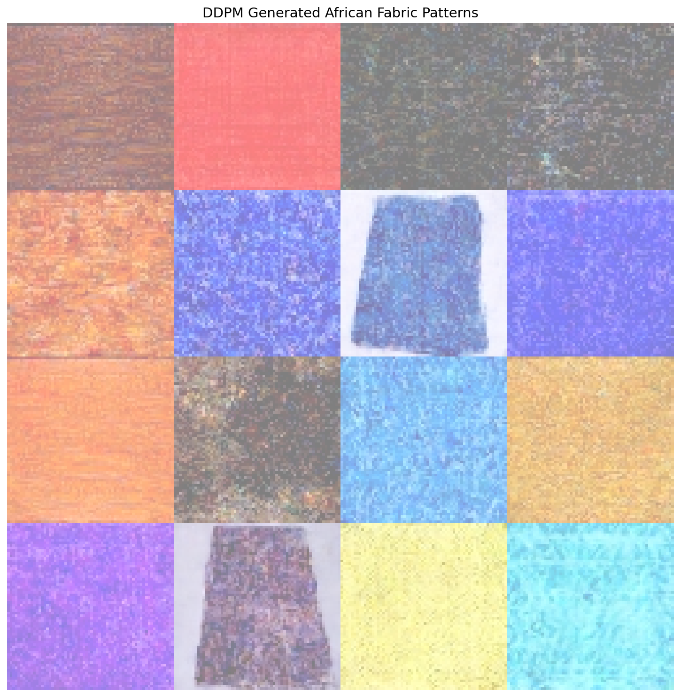
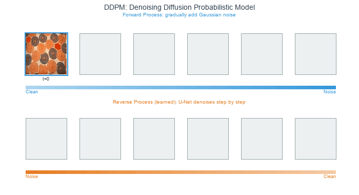
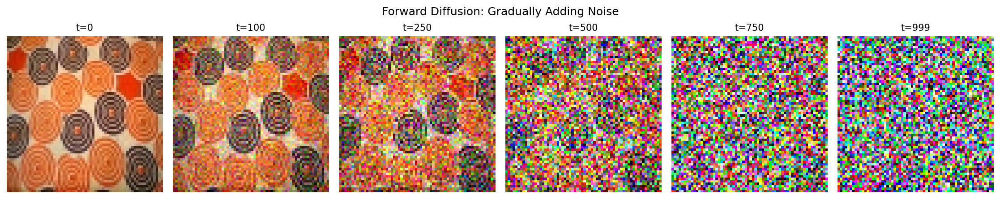
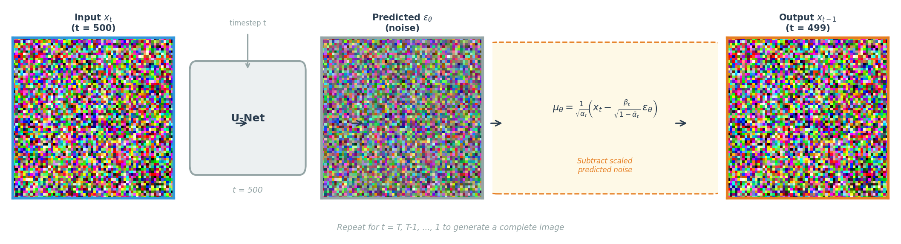
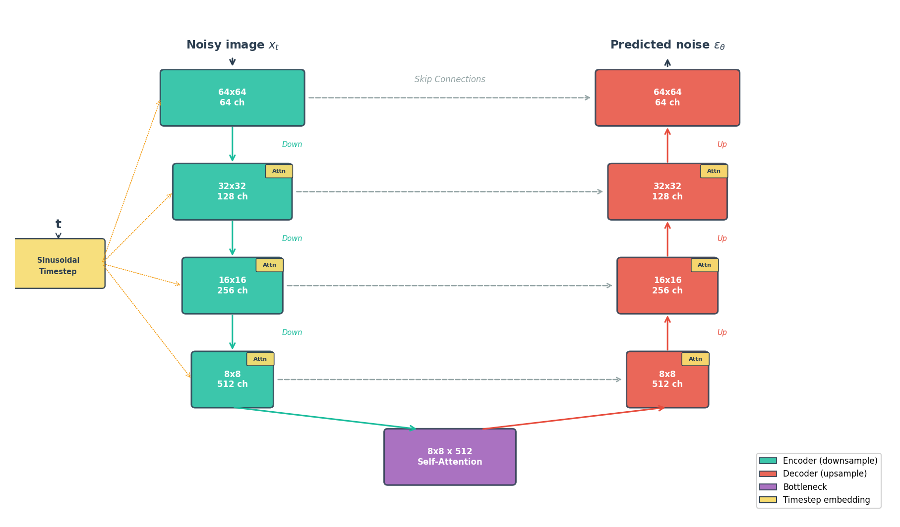
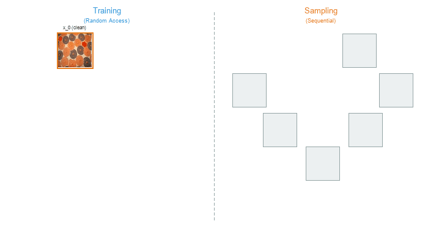
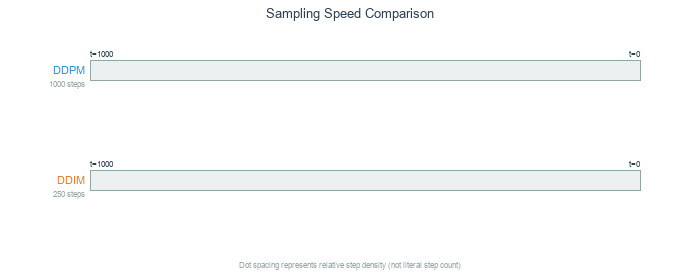
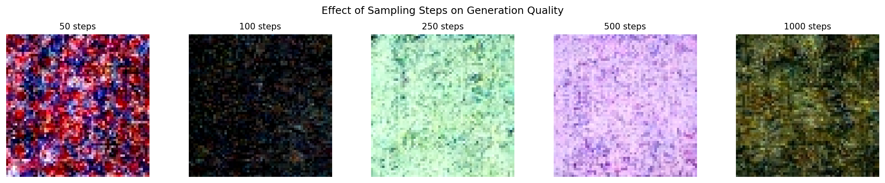
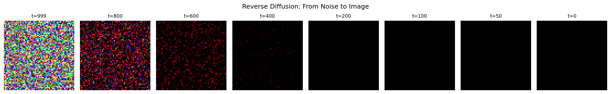

============================================
12.3.1 - DDPM Basics: Denoising Diffusion
============================================

:Duration: 40-50 minutes (core) + optional training extension
:Level: Advanced

Overview
========

Denoising Diffusion Probabilistic Models (DDPMs) displaced GANs as the dominant generative architecture within two years of their introduction [Ho2020]_. Unlike GANs, which learn to generate images through adversarial training, diffusion models learn to reverse a gradual noise corruption process. Starting from pure Gaussian noise, the model iteratively denoises to produce coherent images.

In this exercise, we apply DDPM to generate African fabric patterns [Picton1995]_, the same dataset used in Modules 12.1.2 (DCGAN) and 12.1.3 (StyleGAN). This allows direct comparison of three different generative approaches on identical data.

.. list-table::
   :widths: 50 50

   * - .. figure:: training_samples_grid.png
          :width: 100%
          :alt: Training dataset samples

          **Training Data** (9 of 1,059 images)

     - .. figure:: visuals/ddpm_fabric_morph.gif
          :width: 100%
          :alt: DDPM morphing animation showing smooth transitions between generated fabric patterns

          **Generated Animation** (Smooth latent interpolation)

Learning Objectives
-------------------

This exercise covers four capabilities:

1. **Understand the diffusion process**: How noise is added during forward diffusion and removed during reverse diffusion
2. **Explore parameter effects**: How sampling steps, noise seeds, and timestep capture affect generation quality and output
3. **Create a morphing animation**: Blend noise vectors to produce smooth transitions between generated patterns
4. **Compare generative approaches**: Evaluate DDPM output against DCGAN and StyleGAN results

Quick Start
===========

First, the result: here is what a trained diffusion model can generate. This requires a pre-trained model, which you will create in Exercise 3.

.. dropdown:: Pre-trained Model Required
   :class-title: sd-font-weight-bold

   Exercises 1 and 2 require a trained checkpoint. Either:

   1. Complete Exercise 3 first to train your own model (~4-6 hours), OR
   2. Download pre-trained weights using one of these methods:

      **Option A: GitHub CLI** (if installed)

      .. code-block:: bash

         cd content/Module_12_generative_ai_models/12.3_diffusion_models/12.3.1_ddpm_basics
         mkdir -p models
         gh release download v1.0.0-ddpm-weights -p "ddpm_african_fabrics.pt" -D models/

      **Option B: Direct Download**

      1. Visit: https://github.com/burakkagann/Pixels2GenAI/releases/tag/v1.0.0-ddpm-weights
      2. Download ``ddpm_african_fabrics.pt`` (546 MB)
      3. Place it in the ``models/`` folder

   **Verify installation:**

   .. code-block:: bash

      ls models/ddpm_african_fabrics.pt  # Should show the file

Once you have a trained model, generate fabric patterns:

.. code-block:: python

   from denoising_diffusion_pytorch import Unet, GaussianDiffusion
   from torchvision.utils import save_image
   import torch

   # Build the U-Net and diffusion pipeline
   model = Unet(dim=64, dim_mults=(1, 2, 4, 8), channels=3)
   diffusion = GaussianDiffusion(
      model, image_size=64, timesteps=1000, sampling_timesteps=250
   )

   # Load pre-trained weights
   checkpoint = torch.load('models/ddpm_african_fabrics.pt', map_location='cpu')
   ema_state = checkpoint['ema']
   state_dict = {k.replace('ema_model.', ''): v
               for k, v in ema_state.items() if k.startswith('ema_model.')}
   diffusion.load_state_dict(state_dict)
   diffusion.eval()

   # Generate 4 fabric patterns from pure noise
   with torch.no_grad():
      samples = diffusion.sample(batch_size=4)
   # samples shape: [4, 3, 64, 64] -- values in [0, 1]

   # Upscale from 64x64 to 256x256 for better viewing quality
   samples_up = torch.nn.functional.interpolate(
      samples, scale_factor=4, mode='nearest'
   )
   save_image(samples_up, 'quick_start_output.png', nrow=2,
              padding=4, pad_value=1)

   # Upscale from 64x64 to 256x256 for better viewing quality
   samples_upscaled = torch.nn.functional.interpolate(
      samples, scale_factor=4, mode='nearest'
   )
   save_image(samples_upscaled, 'quick_start_output.png', nrow=2,
            normalize=True, value_range=(-1, 1), padding=4, pad_value=1)
   print("Saved quick_start_output.png")

   16 fabric patterns generated by DDPM through iterative denoising.

Core Concepts
=============

Core Concept 1: The Diffusion Revolution
-----------------------------------------

What makes diffusion models different from GANs? The key insight is direct: *instead of learning to generate images directly, learn to reverse a corruption process* [SohlDickstein2015]_.

Consider this thought experiment: if you slowly add noise to an image over 1000 steps, eventually you get pure random noise. But what if you could learn to reverse each step? Starting from random noise, you could step backwards to recover a clean image.

   Forward process (top): noise gradually corrupts a clean image over 1000 steps. Reverse process (bottom): starting from pure noise, the model denoises step-by-step to recover an image.

**Why this matters:**

- **Stable training**: No adversarial dynamics -- the loss is MSE between predicted and actual noise, the same squared-error measure used in Module 9.2.1's feedforward networks
- **Mode coverage**: Does not suffer from mode collapse like GANs
- **Quality**: Competitive with or surpassing GANs on FID benchmarks, powering Stable Diffusion [Rombach2022]_ and DALL-E 2 [Ramesh2022]_
- **Controllability**: Natural framework for conditioning and guidance

.. admonition:: Historical Context

   The mathematical theory of diffusion processes dates back to Feller's work on stochastic processes [Feller1949]_, while the specific inspiration for generative diffusion models came from non-equilibrium thermodynamics [SohlDickstein2015]_. The key insight that made them practical for image generation came in 2015 [SohlDickstein2015]_, but it took until 2020 for DDPMs to achieve competitive image quality [Ho2020]_. For detailed annotated implementations, see [LabML2024]_.

**Comparison with GANs**

.. list-table::
   :header-rows: 1
   :widths: 25 37 38

   * - Aspect
     - DDPM
     - GAN (DCGAN/StyleGAN)
   * - Training
     - Stable, simple loss
     - Can be unstable, mode collapse
   * - Sampling
     - Iterative (slower)
     - Single pass (faster)
   * - Quality
     - State-of-the-art
     - Excellent but can have artifacts
   * - Diversity
     - High (full distribution)
     - Can miss modes
   * - Controllability
     - Natural (guidance)
     - Requires conditioning

Core Concept 2: Forward Diffusion (Adding Noise)
-------------------------------------------------

The forward diffusion process gradually corrupts a clean image :math:`x_0` over :math:`T` timesteps by adding Gaussian noise [Ho2020]_ -- random per-pixel perturbations that look like grain or static when applied to images. At each step, we add a small amount of this noise controlled by a schedule :math:`\beta_t`:

.. math::

   q(x_t | x_{t-1}) = \mathcal{N}(x_t; \sqrt{1-\beta_t} x_{t-1}, \beta_t I)

The factor :math:`\sqrt{1-\beta_t}` slightly shrinks the previous image, while :math:`\beta_t` controls how much fresh noise gets mixed in. Because :math:`\beta_t` is small (between 0.0001 and 0.02), each individual step barely changes the image -- the corruption accumulates gradually over hundreds of steps.

A key mathematical property allows us to sample :math:`x_t` directly from :math:`x_0` without iterating through all previous steps:

.. math::

   q(x_t | x_0) = \mathcal{N}(x_t; \sqrt{\bar{\alpha}_t} x_0, (1-\bar{\alpha}_t) I)

where :math:`\bar{\alpha}_t = \prod_{s=1}^{t} (1 - \beta_s)` is the cumulative product of noise retention. What does :math:`\bar{\alpha}_t` measure? At t=0, it equals 1.0 -- the image is untouched. By t=500, it drops near zero under a linear schedule, meaning almost all original signal has been replaced by noise. This closed-form shortcut is what makes training efficient: rather than running 500 sequential noise additions, we jump directly to any noise level in one step.

   Forward diffusion from clean image (t=0) to pure noise (t=999).

**The Noise Schedule**

The schedule :math:`\beta_t` controls how quickly noise is added. Two common choices:

- **Linear schedule**: :math:`\beta_t` increases linearly from 0.0001 to 0.02 [Ho2020]_
- **Cosine schedule**: Smoother progression that preserves image information longer [Nichol2021]_

.. figure:: visuals/noise_schedule_comparison.png
   :width: 700px
   :align: center
   :alt: Comparison of linear and cosine noise schedules

   Linear vs cosine noise schedules. *Diagram generated with Claude - Opus 4.5.*

Reading the figure:

- **Top-right panel** (Signal Retention Over Time): the cosine schedule (red) retains substantially more of the original image at middle timesteps compared to the linear schedule (blue), which drops signal aggressively before t=250.

- **Bottom-right bar chart**: at t=250, cosine preserves roughly 85% of the original signal while linear retains under 50%.

- **Why this matters for training**: the model receives more informative examples at intermediate noise levels. With cosine scheduling, the image remains partially visible rather than nearly destroyed, giving the network more useful gradients to learn from.

Core Concept 3: Reverse Diffusion (Denoising)
----------------------------------------------

The reverse process is where generation happens. We train a neural network to predict the noise that was added at each timestep, then subtract it [Ho2020]_. The core idea is a three-step loop:

1. Take a noisy image at timestep *t*.
2. Ask the network: "what noise was added?"
3. Subtract a scaled version of that predicted noise to get a slightly cleaner image at timestep *t-1*.

Repeat this 1000 times -- starting from pure noise at t=999 and ending at a clean image at t=0 -- and you have generation.

**Noise Space is Continuous**

A remarkable property of diffusion models is that nearby points in noise space produce related images. If you start with noise vector A and generate a fabric pattern, then create a second noise vector B that is only slightly different, the result will be a slightly different fabric pattern -- not something completely unrelated. This continuity means you can smoothly blend between two noise vectors using simple arithmetic, walking through intermediate points to produce a fluid visual transition between two patterns. You will apply this property directly in Exercise 3.

   One denoising step: the U-Net predicts the noise, then the formula subtracts it to produce a cleaner image. Repeat from t=T down to t=1.

**Training** is surprisingly simple: take a clean image, add a known amount of noise at a random timestep, ask the network to predict that noise, and minimize the squared error between the true and predicted noise. No adversarial training, no reconstruction loss -- just mean squared error on the noise prediction.

.. dropdown:: Mathematical Details
   :class-title: sd-font-weight-bold

   The reverse process is modeled as a Gaussian distribution:

   .. math::

      p_\theta(x_{t-1} | x_t) = \mathcal{N}(x_{t-1}; \mu_\theta(x_t, t), \sigma_t^2 I)

   Given a noisy image :math:`x_t` and the current timestep :math:`t`, predict what the slightly cleaner image :math:`x_{t-1}` should look like. The mean is computed as:

   .. math::

      \mu_\theta(x_t, t) = \frac{1}{\sqrt{\alpha_t}} \left( x_t - \frac{\beta_t}{\sqrt{1-\bar{\alpha}_t}} \epsilon_\theta(x_t, t) \right)

   The network :math:`\epsilon_\theta` estimates the noise component, and this formula subtracts a scaled version of that estimate from :math:`x_t`. The scaling factors are derived from the forward process parameters -- they ensure the subtraction removes the right *amount* of predicted noise for each specific timestep.

   The training loss measures how accurately the network predicts noise:

   .. math::

      L = \mathbb{E}_{t, x_0, \epsilon} \left[ \| \epsilon - \epsilon_\theta(\sqrt{\bar{\alpha}_t} x_0 + \sqrt{1-\bar{\alpha}_t} \epsilon, t) \|^2 \right]

   Read this from inside out: take a clean image :math:`x_0`, corrupt it to timestep :math:`t` using the forward process (the expression inside the parentheses), then ask the network to recover the original noise :math:`\epsilon`. The squared difference is the entire loss.

**U-Net Architecture**

Recall the encoder-decoder structure from Module 12.2.1 (VAEs): the encoder compresses spatial dimensions while increasing channel depth, then the decoder reverses this. A problem arises for noise prediction -- the decoder must reconstruct *pixel-level detail*, yet the bottleneck discards fine spatial information during compression. The U-Net [Ronneberger2015]_ solves this by adding **skip connections** that pipe each encoder layer's output directly to the corresponding decoder layer at the same resolution. The code block below shows this mechanism: ``skips.append(x)`` stores encoder outputs, and ``torch.cat([x, skips.pop()], dim=1)`` concatenates them back during decoding.

For diffusion models specifically, the U-Net includes four key modifications: timestep conditioning, self-attention, residual connections, and group normalization.

   U-Net for noise prediction. Encoder (left, teal) compresses the image; decoder (right, coral) reconstructs it. Skip connections (dashed) preserve fine detail. Timestep embeddings condition every block.

.. dropdown:: Architecture Details (Optional)
   :class-title: sd-font-weight-bold

   1. **Timestep conditioning** [Vaswani2017]_: The network must handle 1000 different noise levels. Sinusoidal embeddings encode the timestep integer as a high-dimensional vector of sine and cosine values at different frequencies -- the same positional encoding technique used in Transformers.
   2. **Self-attention** [Vaswani2017]_: How does a network ensure that a fabric pattern's color stays coherent across the entire image? Self-attention lets each spatial position "see" every other position, capturing long-range dependencies that local convolutions miss.
   3. **Residual connections** [He2016]_: Each block computes ``output = block(input) + input`` rather than just ``block(input)``. The added shortcut lets gradients flow directly through the network during backpropagation, which is critical when stacking dozens of convolutional layers.
   4. **Group normalization** [Wu2018]_: Works like the batch normalization from Module 12.1.1, but normalizes across groups of channels within a *single* image rather than across the batch dimension. Diffusion training typically uses small batches due to memory constraints, and batch statistics become noisy when computed over fewer than ~16 samples.

.. code-block:: python

   # Simplified U-Net forward pass
   def forward(self, x, t):
       # Embed timestep using sinusoidal encoding
       t_emb = self.time_embedding(t)

       # Encoder: downsample while increasing channels
       skips = []
       for down_block in self.encoder:
           x = down_block(x, t_emb)
           skips.append(x)

       # Bottleneck with self-attention
       x = self.bottleneck(x, t_emb)

       # Decoder: upsample while using skip connections
       for up_block in self.decoder:
           x = up_block(torch.cat([x, skips.pop()], dim=1), t_emb)

       return self.output_conv(x)  # Predicted noise

Core Concept 4: Training vs Sampling
-------------------------------------

Training and sampling in diffusion models exhibit a striking asymmetry. Training can process any timestep independently -- a single batch might contain images at t=50, t=300, and t=800 simultaneously. Sampling, by contrast, must walk through every timestep in sequence, because each denoised output feeds into the next step.

   Training (left) processes random timesteps in parallel. Sampling (right) must proceed sequentially from noise to clean image, one step at a time.

**Training Algorithm**

.. code-block:: text

   Algorithm 1: Training [Ho2020]
   ------------------------------
   repeat:
       x_0 ~ q(x_0)                        # Sample clean image from dataset
       t ~ Uniform({1,...,T})              # Sample random timestep
       epsilon ~ N(0, I)                   # Sample noise
       x_t = sqrt(alpha_bar_t) * x_0       # Add noise to image
            + sqrt(1 - alpha_bar_t) * epsilon
       L = ||epsilon - model(x_t, t)||^2   # MSE loss
       gradient_step(L)
   until converged

The training loop implements Concept 2's forward process directly: line 4 uses the closed-form equation :math:`q(x_t | x_0)` to jump straight from :math:`x_0` to :math:`x_t` at a random timestep. The network then predicts which noise :math:`\epsilon` was added (line 6), and the MSE loss (line 7) measures how far off that prediction was. Because each training iteration samples a *single random timestep*, the model gradually learns to denoise at every noise level without ever running the full 1000-step chain.

**Sampling Algorithm**

.. code-block:: text

   Algorithm 2: Sampling [Ho2020]
   ------------------------------
   x_T ~ N(0, I)                           # Start from pure noise
   for t = T, T-1, ..., 1:
       z ~ N(0, I) if t > 1 else z = 0
       epsilon_pred = model(x_t, t)        # Predict noise
       x_{t-1} = (1/sqrt(alpha_t)) *
           (x_t - (1-alpha_t)/sqrt(1-alpha_bar_t) * epsilon_pred)
           + sigma_t * z                   # sigma_t = sqrt(beta_t)
   return x_0

Sampling reverses the process: start from pure noise :math:`x_T` and iterate backwards. At each step, the model predicts the noise component (line 4), then line 5 applies Concept 3's :math:`\mu_\theta` formula to subtract a scaled version of that predicted noise. The extra noise term :math:`\sigma_t z` (line 6) maintains stochasticity -- each generation run produces different outputs from the same starting noise. This sequential dependency is why diffusion models generate images more slowly than GANs, which produce output in a single forward pass.

**DDIM: Faster Sampling**

Running all T=1000 steps during generation is expensive. DDIM [Song2021]_ reformulates the reverse process as deterministic, which allows timestep *skipping* -- jumping from t=1000 directly to t=996, then to t=992, and so on. With 250 evenly-spaced steps instead of 1000 sequential ones, generation quality remains nearly identical while wall-clock time drops by roughly 4x. Our exercises default to 250 DDIM steps for this reason.

   DDIM (bottom) matches DDPM quality (top) with only 250 steps instead of 1000 -- roughly 4x faster. Dashed arcs show skipped timesteps.

Hands-On Exercises
==================

Now it is time to apply what you've learned with three progressively challenging exercises. Each builds on the previous one using the **Execute → Modify → Create** approach [Sweller1985]_, [Mayer2020]_.

Exercise 1: Generate Fabric Patterns (Execute)
-----------------------------------------------

:download:`Download exercise1_generate.py <exercise1_generate.py>`

**Goal**: Run the pre-trained DDPM to generate African fabric patterns.

**Prerequisites**: Trained model at ``models/ddpm_african_fabrics.pt``

.. code-block:: bash

   python exercise1_generate.py

.. dropdown:: Key Functions Used
   :class-title: sd-font-weight-bold

   ``np.zeros((channels, height, width))``
      Create an array filled with zeros. Used here to prepare an empty canvas for the output
      grid before pasting individual generated images into it.

   ``np.ceil(x)`` / ``np.sqrt(x)``
      Ceiling and square root. ``int(np.ceil(np.sqrt(16)))`` gives 4, which is used to compute the
      grid layout (4 rows by 4 columns for 16 images).

   ``array.transpose(1, 2, 0)``
      Rearrange the dimensions of an array. PyTorch stores images as (C, H, W) --
      channels first -- but image files expect (H, W, C). Transposing moves the channel
      axis to the end so matplotlib and PIL can display the image correctly.

   ``array.astype(np.uint8)``
      Convert array values to unsigned 8-bit integers (0-255). Generated samples are
      floating-point values in [0, 1]; multiplying by 255 and casting to ``uint8``
      produces standard image pixel values.

**What to observe:**

1. Generation takes ~30 seconds (250 DDIM steps)
2. Output shows 16 unique fabric patterns
3. Compare detail and diversity with your DCGAN outputs from Module 12.1.2

.. dropdown:: Reflection Questions
   :class-title: sd-font-weight-bold

   1. How do DDPM-generated patterns compare to DCGAN output? Consider detail, color consistency, and pattern coherence.

   .. dropdown:: Discussion
      :class-title: sd-font-weight-bold

      DDPM outputs typically show finer detail and more coherent patterns than DCGAN. The iterative denoising process produces smoother color transitions and fewer checkerboard artifacts. However, DCGAN generates images in a single forward pass (~1 ms) versus DDPM's 250 iterative steps (~30 seconds).

   2. The diffusion model uses 1000 timesteps for training but only 250 for sampling. Why does this work?

   .. dropdown:: Discussion
      :class-title: sd-font-weight-bold

      DDIM (Core Concept 4) reformulates the reverse process as deterministic, allowing timestep skipping. The model learned to predict noise at every level during training, so DDIM can jump from t=1000 directly to t=996 -- the predicted noise is accurate enough to skip multiple steps without significant quality loss.

   3. What advantages might diffusion models have over GANs for this dataset?

   .. dropdown:: Discussion
      :class-title: sd-font-weight-bold

      Diffusion models cover the full data distribution without mode collapse, meaning they can generate the full diversity of fabric patterns in the training set. GANs sometimes "forget" rare patterns. The stable MSE training loss also means no training instability or generator-discriminator imbalance.

Exercise 2: Explore Diffusion Parameters (Modify)
--------------------------------------------------

:download:`Download exercise2_explore.py <exercise2_explore.py>`

**Goal**: Understand how different parameters affect the generation process by changing specific values in the CONFIG section and re-running the script.

Open ``exercise2_explore.py`` and locate the ``CONFIG`` section at the top of the file. Each goal below asks you to change one labeled parameter, re-run the script, and observe the effect.

You can run a single goal at a time for faster feedback using the ``--goal`` flag:

.. code-block:: bash

   python exercise2_explore.py --goal 1   # Only sampling step comparison (~1 min)
   python exercise2_explore.py --goal 2   # Only forward diffusion (~30 sec)
   python exercise2_explore.py --goal 4   # Only denoising visualization (~2 min)
   python exercise2_explore.py             # Run all explorations

.. dropdown:: Key Functions Used
   :class-title: sd-font-weight-bold

   ``np.array(list)``
      Convert a Python list to a NumPy array. Used here to convert a list of PIL images
      into an array suitable for matplotlib display and GIF creation.

   ``np.clip(array, min, max)``
      Clamp all values in the array to fall within [min, max]. After denormalizing from
      the model's [-1, 1] range, ``np.clip(img, 0, 1)`` ensures no values overshoot the
      valid [0, 1] range before converting to pixel values.

   ``array.astype(np.uint8)``
      Convert array values to unsigned 8-bit integers (0-255). Necessary for creating
      GIF frames from floating-point model outputs.

**Goal 1**: Test DDIM sampling speed (Core Concept 4)

Change ``SAMPLING_STEPS`` from ``250`` to ``50``, then re-run. Then try ``1000``.

.. code-block:: python

   # In the CONFIG section at the top of exercise2_explore.py:
   SAMPLING_STEPS = 50   # Was 250. Try: 50, 250, 1000

.. dropdown:: What to expect
   :class-title: sd-font-weight-bold

   - **50 steps**: Faster (~6 seconds) but patterns may show subtle artifacts or blurriness
   - **250 steps** (default): Good balance of quality and speed (~30 seconds)
   - **1000 steps**: Best quality but ~2 minutes. Difference from 250 is often minimal -- this illustrates DDIM's efficiency

   Quality improves with more steps, but with diminishing returns beyond 250.

**Goal 2**: See early forward diffusion stages (Core Concept 2)

Change ``TIMESTEPS_TO_SHOW`` to include early timesteps where the image is barely corrupted.

.. code-block:: python

   # In the CONFIG section:
   TIMESTEPS_TO_SHOW = [0, 25, 50, 100, 250, 500, 750, 999]
   # Was [0, 100, 250, 500, 750, 999]. Added t=25 and t=50.

.. dropdown:: What to expect
   :class-title: sd-font-weight-bold

   Adding t=25 and t=50 reveals how little noise is added in the first few steps. At t=25, the image is almost indistinguishable from the original. By t=100, faint grain appears. This illustrates why the noise schedule starts small (beta_1 = 0.0001) and increases gradually.

   Forward diffusion from clean image (t=0) to pure noise (t=999).

**Goal 3**: Verify that seed controls identity (Core Concept 3)

Change ``RANDOM_SEED`` to three different values (for example 42, 7, 123) and compare the generated patterns each time you re-run.

.. code-block:: python

   # In the CONFIG section:
   RANDOM_SEED = 7    # Was 42. Try: 7, 123, 999

.. dropdown:: What to expect
   :class-title: sd-font-weight-bold

   Each seed produces a completely different pattern, but running the same seed twice yields identical output. The seed determines the starting noise vector, and since DDIM sampling is deterministic, the same noise always produces the same image. This is how you can reliably reproduce a pattern you like.

**Goal 4**: Capture more denoising detail (Core Concept 3)

Change ``CAPTURE_TIMESTEPS`` to add intermediate points in the denoising visualization.

.. code-block:: python

   # In the CONFIG section:
   CAPTURE_TIMESTEPS = [999, 900, 800, 700, 600, 500, 400, 300, 200, 100, 50, 0]
   # Was [999, 800, 600, 400, 200, 100, 50, 0]. Added 900, 700, 500, 300.

.. dropdown:: What to expect
   :class-title: sd-font-weight-bold

   Filling in the gaps reveals a non-linear progression. Structure first emerges around t=600-400 as the model resolves large-scale color regions. Fine detail -- edges, textures, sharp boundaries -- resolves between t=200-50. Most perceptible change happens in the middle timesteps, not at the extremes.

   Reverse diffusion: the model progressively removes noise to reveal the pattern.

Exercise 3: Create a Morphing Animation (Create)
-----------------------------------------

:download:`Download exercise3_morph.py <exercise3_morph.py>`

**Goal**: Blend between two noise vectors to create a smooth fabric pattern transition.

In Core Concept 3 you learned that nearby points in noise space produce visually similar images. Here you will put that idea into practice: pick two random noise vectors, blend them at different ratios, generate an image from each blend, and assemble the results into an animated GIF.

.. dropdown:: What is Noise Blending?
   :class-title: sd-font-weight-bold

   Think of it like mixing two paint colors. If you have a pot of blue paint (noise A) and a pot of red paint (noise B), mixing them at different ratios gives you a smooth gradient from blue through purple to red.

   The formula is the same idea applied to noise tensors:

   .. code-block:: text

      blended = (1 - t) * noise_a + t * noise_b

   When ``t = 0.0``, you get 100% noise A (pure blue).
   When ``t = 0.5``, you get a 50/50 mix (purple).
   When ``t = 1.0``, you get 100% noise B (pure red).

   Because the diffusion model maps nearby noise vectors to visually similar images, this arithmetic blending in noise space produces a smooth visual morph in image space.

.. dropdown:: NumPy and PyTorch Functions You'll Need
   :class-title: sd-font-weight-bold

   ``np.linspace(start, stop, num)``
      Create ``num`` evenly-spaced values between ``start`` and ``stop``.
      ``np.linspace(0.0, 1.0, 20)`` produces 20 blend ratios: [0.0, 0.053, 0.105, ..., 1.0].
      You will use these as the ``t`` values in the blending formula.

   ``torch.manual_seed(seed)``
      Lock PyTorch's random number generator to produce identical results every time.
      Same concept as ``np.random.seed()`` but for PyTorch tensors. Already provided
      in the starter code (Step 2).

   ``torch.randn(shape)``
      Draw random numbers from a standard normal distribution (mean=0, std=1)
      and return them as a PyTorch tensor. Same concept as ``np.random.randn()``
      but returns a tensor instead of an array. The shape ``(1, 3, 64, 64)``
      means: 1 image, 3 color channels, 64x64 pixels. Already provided in the
      starter code (Step 2).

**Requirements**:

- Trained model at ``models/ddpm_african_fabrics.pt`` (from the Extension training or downloaded weights)
- Libraries: ``torch``, ``numpy``, ``imageio``

**Instructions**:

Open ``exercise3_morph.py``. The script is mostly complete -- you need to fill in 2 TODOs in Step 3. Each TODO has an inline comment telling you exactly what to write. Steps 1, 2, and 4 are provided and require no changes.

After completing the TODOs, run the script:

.. code-block:: bash

   python exercise3_morph.py

.. dropdown:: Hint 1: Creating blend values
   :class-title: sd-font-weight-bold

   ``np.linspace`` creates evenly-spaced values between a start and stop.
   You need values from 0.0 (100% noise A) to 1.0 (100% noise B):

   .. code-block:: python

      blend_values = np.linspace(0.0, 1.0, NUM_FRAMES)

.. dropdown:: Hint 2: Blending formula
   :class-title: sd-font-weight-bold

   The interpolation formula translates directly into Python arithmetic.
   Both ``noise_a`` and ``noise_b`` are tensors, and ``t`` is a scalar:

   .. code-block:: python

      blended_noise = (1 - t) * noise_a + t * noise_b

.. dropdown:: Complete Solution
   :class-title: sd-font-weight-bold

   .. code-block:: python

      # TODO 1:
      blend_values = np.linspace(0.0, 1.0, NUM_FRAMES)

      # TODO 2 (inside the loop):
      blended_noise = (1 - t) * noise_a + t * noise_b

**Make It Your Own**

After completing the TODOs, experiment with the CONFIG parameters at the top of the script:

- **Different pattern pairs**: Change ``SEED_A`` and ``SEED_B`` to discover transitions between different fabric styles. Try ``SEED_A = 7, SEED_B = 999`` for a dramatic shift.
- **Smoother animation**: Increase ``NUM_FRAMES`` to 30 or 60 for a more fluid morph.
- **Pacing**: Lower ``FPS`` to 5 for a slow reveal, or raise it to 20 for a quick flip.
- **Resolution**: Set ``OUTPUT_SIZE = 512`` for a higher-resolution GIF (slower to generate).

Create several animations with different seed pairs to build a small gallery of morphing patterns.

.. dropdown:: Challenge Extension: Spherical Interpolation
   :class-title: sd-font-weight-bold

   Linear interpolation (``lerp``) takes the shortest straight-line path between two points. Spherical interpolation (``slerp``) follows the surface of a hypersphere, keeping the magnitude of the blended vector constant throughout the transition.

   The helper module already provides a ``slerp`` function. Import it and replace the linear blend:

   .. code-block:: python

      from generate_ddpm_morph import slerp

      # Replace:  blended_noise = (1 - t) * noise_a + t * noise_b
      # With:
      blended_noise = slerp(t, noise_a, noise_b)

   Compare the two GIFs side-by-side. Slerp often produces transitions where each intermediate frame looks equally "sharp", while lerp can produce slightly dimmer mid-points.

.. figure:: visuals/ddpm_fabric_morph.gif
   :width: 400px
   :align: center
   :alt: Morphing animation showing smooth transitions between generated fabric patterns

   Example morphing animation transitioning between two fabric patterns.

Extension: Train Your Own DDPM (Optional)
------------------------------------------

:download:`Download exercise3_train.py <exercise3_train.py>`

This section walks through training a DDPM from scratch on the African fabric dataset. Training takes approximately 15-20 hours on an RTX 5070Ti GPU (500,000 steps). It is entirely optional -- Exercises 1-3 use pre-trained weights that can be downloaded from the `GitHub Releases page <https://github.com/burakkagann/Pixels2GenAI/releases/tag/v1.0.0-ddpm-weights>`_.

**Step 1: Verify Dataset**

The training uses the preprocessed African fabric dataset from Module 12.1.2:

.. code-block:: bash

   python exercise3_train.py --verify

Expected output: "Found 1059 images in dataset"

**Step 2: Start Training**

.. code-block:: bash

   python exercise3_train.py --train

**Training Configuration**:

.. list-table::
   :widths: 30 70

   * - Image Size
     - 64x64 (consistent with DCGAN/StyleGAN)
   * - Batch Size
     - 32
   * - Learning Rate
     - 8e-5 (Adam optimizer)
   * - Training Steps
     - 500,000
   * - Diffusion Timesteps
     - 1000
   * - Model Parameters
     - ~34M (U-Net with attention)

**What to Monitor**:

- Loss should decrease from ~0.5 to ~0.01-0.03
- Sample images saved every 25,000 steps in ``training_results/``
- Training is stable; no mode collapse like GANs

**Step 3: Generate from Your Model**

After training completes:

.. code-block:: bash

   python exercise1_generate.py

Your model weights are saved at ``models/ddpm_african_fabrics.pt``.

Training Results: Observing DDPM Learning
~~~~~~~~~~~~~~~~~~~~~~~~~~~~~~~~~~~~~~~~~

.. dropdown:: Training Dynamics and Visual Progression
   :class-title: sd-font-weight-bold

   **Visual Progression**

   Checkpoints saved every 25,000 steps with 16 sample images each.

   .. figure:: training_results/sample-1.png
      :width: 400px
      :align: center
      :alt: DDPM samples at step 25,000

      Step 25,000: Fabric-like textures and color diversity already emerging. Geometric patterns (diamonds, zigzags) begin to appear across the grid.

   .. figure:: training_results/sample-5.png
      :width: 400px
      :align: center
      :alt: DDPM samples at step 125,000

      Step 125,000: Textile textures becoming more defined. Good color range across samples with speckled, woven surface qualities appearing.

   .. figure:: training_results/sample-11.png
      :width: 400px
      :align: center
      :alt: DDPM samples at step 275,000

      Step 275,000: Consistent diversity across samples -- blues, pinks, yellows, greens all represented. Grainy textile quality visible in most tiles.

   .. figure:: training_results/sample-20.png
      :width: 400px
      :align: center
      :alt: DDPM samples at step 500,000

      Step 500,000: Final quality -- excellent color diversity with visible fabric-like texture grain. Multi-tonal patterns across the full palette.

.. dropdown:: Troubleshooting Common Issues
   :class-title: sd-font-weight-bold

   **Issue 1: "Model file not found" error**

   **Cause**: The ``models/ddpm_african_fabrics.pt`` file doesn't exist.

   **Solution**:

   1. Complete training first (takes 15-20 hours on GPU)
   2. Or download pre-trained weights from the GitHub releases page
   3. Verify the file path is correct: ``models/ddpm_african_fabrics.pt``

   ---

   **Issue 2: Training is very slow (>24 hours)**

   **Cause**: Training on CPU instead of GPU.

   **Solution**:

   * Verify GPU availability:

     .. code-block:: python

        import torch
        print(torch.cuda.is_available())  # Should print True

   * Install CUDA-enabled PyTorch if False (see https://pytorch.org/get-started/locally/)
   * Expected time: 15-20 hours on RTX 5070Ti (500,000 steps), longer on older GPUs

   ---

   **Issue 3: Out of memory error (CUDA OOM)**

   **Cause**: Batch size too large for GPU memory.

   **Solution**:

   * Edit ``exercise3_train.py`` and reduce ``BATCH_SIZE`` from 32 to 16
   * Reduce ``GRADIENT_ACCUMULATE`` from 2 to 1
   * Training quality is not significantly affected by smaller batches

   ---

   **Issue 4: Generated images are all noise**

   **Possible causes**:

   * Model weights not loaded correctly
   * Training did not complete successfully
   * Wrong checkpoint file loaded

   **Solution**:

   1. Verify the model file exists and has size ~546 MB
   2. Check training completed without errors
   3. Try loading a different checkpoint from ``training_results/model-*.pt``

   ---

   **Issue 5: "denoising-diffusion-pytorch" import error**

   **Cause**: Library not installed.

   **Solution**:

   .. code-block:: bash

      pip install denoising-diffusion-pytorch

   ---

   **Issue 6: Different results than shown in documentation**

   **Cause**: Different random seeds or library versions produce different outputs.

   **Solution**:

   * This is expected - generative models produce varied outputs
   * Set ``RANDOM_SEED`` in the script for reproducibility
   * Visual quality should be similar even if specific patterns differ

.. admonition:: Implementation Note
   :class: note

   This exercise uses the `denoising-diffusion-pytorch <https://github.com/lucidrains/denoising-diffusion-pytorch>`_ library [PhilWang2024]_ by Phil Wang (lucidrains), released under the MIT License. The library provides a clean, efficient implementation of DDPMs [Ho2020]_ suitable for educational purposes.

   Key modifications for this exercise:

   * Configured for 64x64 RGB images (matching DCGAN/StyleGAN modules)
   * DDIM sampling with 250 steps for faster inference
   * Mixed precision training for GPU memory efficiency
   * Checkpoint saving every 25,000 steps for progress visualization

Summary
=======

**Key Takeaways**

1. **Diffusion models reverse noise corruption**: Start from pure noise, iteratively denoise to generate images
2. **Training is stable**: Simple MSE loss, no adversarial dynamics
3. **U-Net predicts noise**: The network learns to estimate the noise added at each timestep
4. **DDIM enables fast sampling**: Generate quality images with 250 steps instead of 1000
5. **Noise space is continuous**: Nearby noise vectors produce related images, enabling smooth morphing

**Common Pitfalls**

.. warning::

   1. **Model not found**: Download pre-trained weights from the GitHub releases page, or complete the training extension
   2. **Different library versions**: Use ``pip install denoising-diffusion-pytorch``
   3. **Out of memory**: Reduce batch size or image size if GPU memory is limited
   4. **Morphing GIF is choppy**: Increase ``NUM_FRAMES`` to 30 or higher for smoother transitions

References
==========

.. [Ho2020] Ho, J., Jain, A., & Abbeel, P. (2020). Denoising Diffusion Probabilistic Models. *Advances in Neural Information Processing Systems*, 33, 6840-6851. https://arxiv.org/abs/2006.11239

.. [SohlDickstein2015] Sohl-Dickstein, J., Weiss, E., Maheswaranathan, N., & Ganguli, S. (2015). Deep Unsupervised Learning using Nonequilibrium Thermodynamics. *International Conference on Machine Learning*, 2256-2265.

.. [Nichol2021] Nichol, A. Q., & Dhariwal, P. (2021). Improved Denoising Diffusion Probabilistic Models. *International Conference on Machine Learning*, 8162-8171. https://arxiv.org/abs/2102.09672

.. [Song2021] Song, J., Meng, C., & Ermon, S. (2021). Denoising Diffusion Implicit Models. *International Conference on Learning Representations*. https://arxiv.org/abs/2010.02502

.. [Ronneberger2015] Ronneberger, O., Fischer, P., & Brox, T. (2015). U-Net: Convolutional Networks for Biomedical Image Segmentation. *Medical Image Computing and Computer-Assisted Intervention*, 234-241.

.. [PhilWang2024] Wang, P. (2024). *denoising-diffusion-pytorch: Implementation of Denoising Diffusion Probabilistic Model in Pytorch*. GitHub repository. https://github.com/lucidrains/denoising-diffusion-pytorch (MIT License)

.. [LabML2024] LabML.ai. (2024). DDPM - Denoising Diffusion Probabilistic Models. *LabML Annotated Implementations*. https://nn.labml.ai/diffusion/ddpm/

.. [Feller1949] Feller, W. (1949). On the Theory of Stochastic Processes, with Particular Reference to Applications. *Proceedings of the Berkeley Symposium on Mathematical Statistics and Probability*, 403-432.

.. [Picton1995] Picton, J. (Ed.). (1995). *The Art of African Textiles: Technology, Tradition and Lurex*. Barbican Art Gallery/Lund Humphries Publishers.

.. [Vaswani2017] Vaswani, A., et al. (2017). Attention Is All You Need. *Advances in Neural Information Processing Systems*, 30, 6000-6010. https://arxiv.org/abs/1706.03762

.. [Rombach2022] Rombach, R., Blattmann, A., Lorenz, D., Esser, P., & Ommer, B. (2022). High-Resolution Image Synthesis with Latent Diffusion Models. *IEEE/CVF Conference on Computer Vision and Pattern Recognition (CVPR)*. https://arxiv.org/abs/2112.10752

.. [Ramesh2022] Ramesh, A., Dhariwal, P., Nichol, A., Chu, C., & Chen, M. (2022). Hierarchical Text-Conditional Image Generation with CLIP Latents. *arXiv preprint*. https://arxiv.org/abs/2204.06125

.. [Wu2018] Wu, Y., & He, K. (2018). Group Normalization. *European Conference on Computer Vision (ECCV)*, 3-19. https://arxiv.org/abs/1803.08494

.. [He2016] He, K., Zhang, X., Ren, S., & Sun, J. (2016). Deep Residual Learning for Image Recognition. *IEEE/CVF Conference on Computer Vision and Pattern Recognition (CVPR)*, 770-778. https://arxiv.org/abs/1512.03385

.. [Sweller1985] Sweller, J. (1985). Optimizing cognitive load in instructional design. *Instructional Science*, 14(3), 195-218.

.. [Mayer2020] Mayer, R. E. (2020). *Multimedia Learning* (3rd ed.). Cambridge University Press. ISBN: 978-1-316-63896-8
