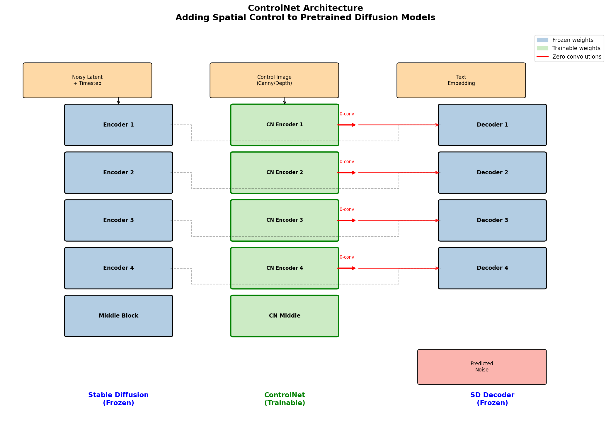
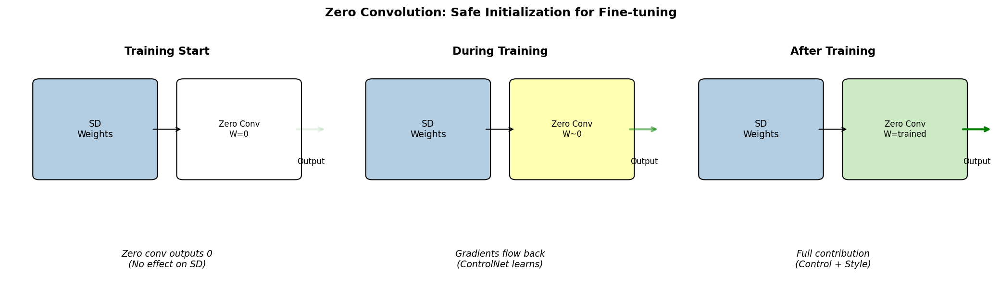
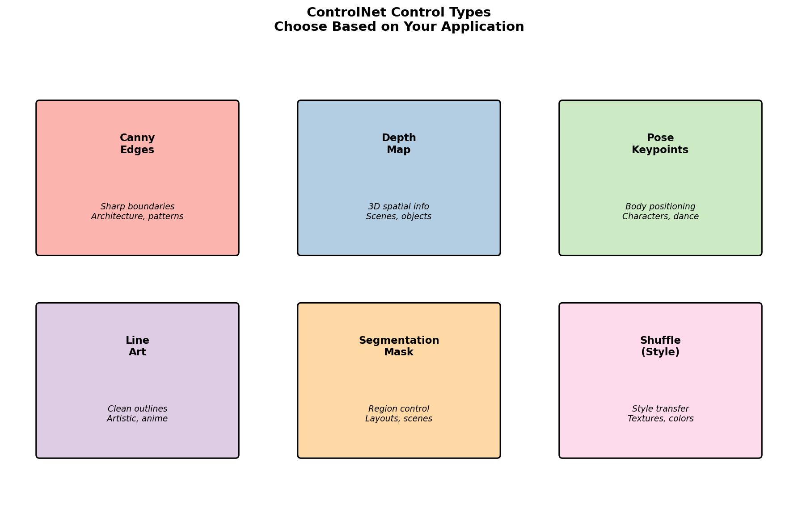
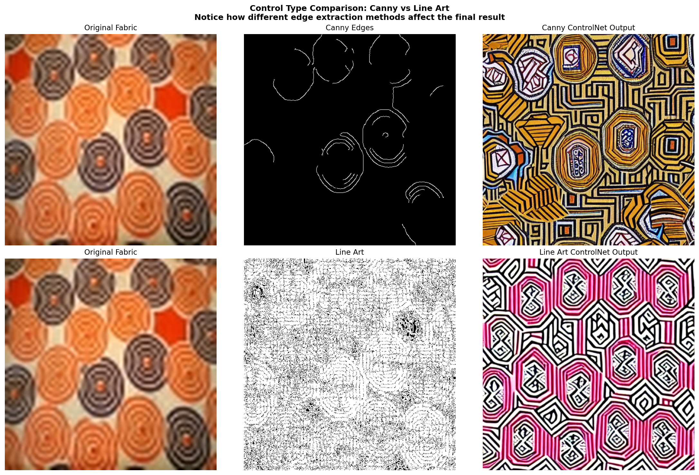
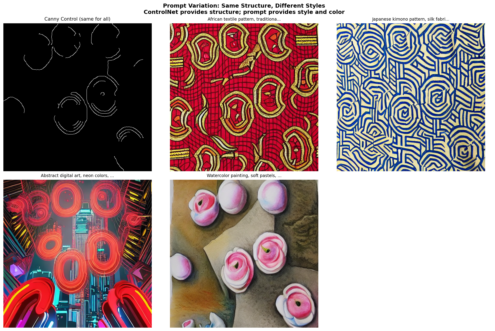

====================================================
12.3.2 - ControlNet: Guided Generation with Control
====================================================

:Duration: 45-55 minutes (core) + 2-4 hours training (Exercise 3)
:Level: Advanced

Overview
========

In Module 12.3.1, you learned how DDPM generates images by reversing a noise corruption process. The diffusion model learns to denoise, producing diverse outputs from random noise. But what if you want to *control* what gets generated? What if you want the model to follow a specific structure while still applying its creative generation?

**ControlNet** [Zhang2023]_ answers this question by adding spatial conditioning to pretrained diffusion models. Rather than generating freely, ControlNet can follow edge maps, depth images, pose skeletons, or other structural guides while preserving the powerful generation capabilities of models like Stable Diffusion.

In this exercise, we explore ControlNet using African fabric patterns from our dataset. You will:

1. Generate fabric-inspired patterns guided by edge structures (Exercise 1)
2. Explore different control types and parameters (Exercise 2)
3. Train ControlNet from scratch AND use LoRA for efficient style adaptation (Exercise 3)

.. list-table::
   :widths: 50 50

   * - .. figure:: fill50k_training_samples_grid.png
          :width: 100%
          :alt: Training samples showing filled circles with colors

          Training samples from Fill50K dataset.

     - .. figure:: controlnet_circle_morph.gif
          :width: 100%
          :alt: Morphing animation showing color evolution

          Color morphing animation with fixed circle structure.

Learning Objectives
-------------------

By the end of this exercise, you will:

1. **Understand ControlNet architecture**: How spatial conditioning is added without destroying pretrained weights
2. **Apply different control types**: Canny edges, line art, and their effects on generation
3. **Train ControlNet from scratch**: Complete training pipeline on the Fill50K dataset
4. **Use LoRA for style adaptation**: Efficient fine-tuning on the African fabric dataset
5. **Combine techniques**: Structure from ControlNet + Style from LoRA

Connection to DDPM Basics (12.3.1)
----------------------------------

ControlNet builds directly on concepts from the previous module:

.. list-table::
   :header-rows: 1
   :widths: 40 60

   * - DDPM Concept
     - ControlNet Extension
   * - U-Net architecture
     - ControlNet clones U-Net encoder, adds conditioning branch
   * - Timestep embeddings
     - Same mechanism, plus spatial conditioning input
   * - Noise prediction
     - Same MSE loss, but conditioned on control signals
   * - DDIM sampling
     - Works unchanged with ControlNet for faster inference
   * - Forward/reverse diffusion
     - Unchanged - ControlNet adds control, not replaces diffusion

**The key insight**: In DDPM, you learned to generate patterns from noise. ControlNet answers: *what if we could GUIDE that generation with structural information?*

**Comparison with DDPM**:

.. list-table::
   :header-rows: 1
   :widths: 30 35 35

   * - Aspect
     - DDPM (Module 12.3.1)
     - ControlNet (This Module)
   * - Structure
     - Varies during morphing
     - Fixed (from conditioning)
   * - Control
     - None (free generation)
     - Circle outline constraint
   * - Use Case
     - Explore generation space
     - Controlled style variation
   * - Output
     - Fabric patterns
     - Color fills in circles

Quick Start
===========

Before diving into theory, let us see ControlNet in action. Run the following to generate fabric patterns guided by edge maps:

.. code-block:: bash

   python exercise1_generate.py

.. note::

   **First Run May Take Time**

   ControlNet models are downloaded from Hugging Face on first run (~2-3 GB).
   Subsequent runs use cached models and are much faster.

.. figure:: exercise1_output.png
   :width: 700px
   :align: center
   :alt: ControlNet generation results

   Original fabric, extracted edges, and generated output.

Core Concepts
=============

Concept 1: From Unconditional to Controlled Generation
------------------------------------------------------

DDPM generates images from pure noise, but we have no control over *what* it generates. The model learns the data distribution and samples from it freely. This is powerful but limiting for creative applications.

**The Problem**: How do we guide generation without retraining the entire model?

**The Solution**: Add a separate conditioning pathway that injects spatial information into the generation process, while keeping the pretrained model frozen.

ControlNet achieves this through a elegant architectural design:

1. **Clone the encoder**: Create a trainable copy of the U-Net encoder
2. **Freeze original weights**: Lock the pretrained Stable Diffusion model
3. **Connect via zero convolutions**: Link the trainable copy to frozen decoder

   ControlNet architecture overview. Diagram generated with Claude - Opus 4.5.

.. admonition:: Key Insight

   ControlNet does not replace diffusion - it *augments* it. The original generation capability is preserved, and conditioning is added on top.

Concept 2: The Zero Convolution Trick
-------------------------------------

A critical challenge: how do we add conditioning without destroying the pretrained knowledge that makes Stable Diffusion so powerful?

The answer is **zero convolutions** - 1x1 convolutions initialized with all weights and biases set to zero [Zhang2023]_.

   Zero convolution initialization concept. Diagram generated with Claude - Opus 4.5.

**Why this works**:

- At training start: Zero convs output 0, so ControlNet has no effect
- The pretrained model continues working exactly as before
- Gradients flow back through zeros, allowing ControlNet to learn
- As training progresses, zero convs learn appropriate contributions

.. code-block:: python

   # Simplified zero convolution
   class ZeroConv2d(nn.Conv2d):
       def __init__(self, in_channels, out_channels):
           super().__init__(in_channels, out_channels, kernel_size=1)
           # Initialize all weights to zero
           nn.init.zeros_(self.weight)
           nn.init.zeros_(self.bias)

   # At start: output = input * 0 + 0 = 0
   # After training: output = input * learned_weights + learned_bias

Concept 3: Control Types and Their Uses
---------------------------------------

ControlNet supports many conditioning types, each suited for different applications:

   Different control types: Canny, Line Art, Depth, Pose. Diagram generated with Claude - Opus 4.5.

**Common Control Types**:

1. **Canny Edges**: Sharp, well-defined boundaries
   - Best for: Architecture, geometric patterns, hard edges
   - African fabrics: Preserves geometric pattern structure

2. **Line Art**: Clean, artistic outlines
   - Best for: Illustration, anime, artistic rendering
   - African fabrics: Softer pattern guidance

3. **Depth Maps**: 3D spatial relationships
   - Best for: Scenes, objects with depth, realistic compositions
   - African fabrics: Less applicable (patterns are 2D)

4. **Pose Keypoints**: Human body positioning
   - Best for: Character art, dance, body poses
   - African fabrics: Not applicable

5. **Shuffle (Style Transfer)**: Extract and apply style
   - Best for: Transferring textures, colors, patterns
   - African fabrics: Captures fabric style without structure lock

Concept 4: Guidance Scale and Creative Freedom
----------------------------------------------

The ``controlnet_conditioning_scale`` parameter controls how strictly the model follows the conditioning image:

.. code-block:: python

   # Scale determines control strength
   output = pipeline(
       prompt="African textile pattern",
       image=canny_edges,
       controlnet_conditioning_scale=0.8  # 0.0 to 1.0+
   )

**Scale Effects**:

- **0.0**: Control is ignored (like vanilla Stable Diffusion)
- **0.3-0.5**: Soft guidance, structure suggested but not enforced
- **0.7-0.8**: Good balance (recommended for most uses)
- **1.0**: Strict adherence to control structure
- **>1.0**: Very strict, may reduce quality

.. figure:: exercise2_strength_sweep.png
   :width: 700px
   :align: center
   :alt: Guidance scale comparison

   Guidance scale comparison from 0.0 to 1.0.

Hands-On Exercises
==================

Exercise 1: Generate with ControlNet (Execute)
----------------------------------------------

**Goal**: Use pretrained ControlNet to generate fabric patterns guided by edge maps.

**Duration**: 10-12 minutes

**Download**: :download:`exercise1_generate.py <exercise1_generate.py>` | :download:`controlnet_utils.py <controlnet_utils.py>`

Run the script:

.. code-block:: bash

   python exercise1_generate.py

**What the script does**:

1. Loads pretrained ControlNet (Canny) from Hugging Face
2. Selects sample African fabric images from Module 12.1.2
3. Extracts Canny edges using OpenCV
4. Generates new patterns following the edge structure
5. Creates comparison grid: Original → Edges → Generated

**Expected Output**:

- ``exercise1_output.png``: Main comparison grid
- ``exercise1_sample_N.png``: Individual sample comparisons

.. figure:: exercise1_output.png
   :width: 700px
   :align: center
   :alt: Exercise 1 output comparison grid

   Main comparison grid showing original fabric, extracted edges, and generated output.

.. list-table::
   :widths: 25 25 25 25

   * - .. figure:: exercise1_sample_1.png
          :width: 100%

          Sample 1

     - .. figure:: exercise1_sample_2.png
          :width: 100%

          Sample 2

     - .. figure:: exercise1_sample_3.png
          :width: 100%

          Sample 3

     - .. figure:: exercise1_sample_4.png
          :width: 100%

          Sample 4

.. dropdown:: Reflection Questions
   :class-title: sd-font-weight-bold

   1. **Structure Preservation**: How much of the original fabric pattern structure is preserved in the output? Compare edge shapes and positions.

   2. **Style Transfer**: The colors and textures change, but the structure remains. Why is this useful for creative applications?

   3. **Comparison with DDPM**: Look at your DDPM outputs from Module 12.3.1. How do they differ from ControlNet outputs? Which gives you more creative control?

   4. **Edge Quality**: Adjust Canny thresholds in ``controlnet_utils.py`` (low_threshold, high_threshold). How does edge density affect results?

Exercise 2: Explore Parameters (Modify)
---------------------------------------

**Goal**: Understand how different control types and parameters affect generation.

**Duration**: 12-15 minutes

**Download**: :download:`exercise2_explore.py <exercise2_explore.py>`

Run the script with different parts:

.. code-block:: bash

   # Run all explorations
   python exercise2_explore.py --part all

   # Or run specific parts
   python exercise2_explore.py --part a  # Control type comparison
   python exercise2_explore.py --part b  # Guidance strength sweep
   python exercise2_explore.py --part c  # Prompt variation

**Part A: Control Type Comparison**

Compares Canny edges vs Line Art extraction:

- Canny: Sharp, well-defined edges (better for geometric patterns)
- Line Art: Smoother, more continuous lines (better for artistic rendering)

   Canny edges vs Line Art control comparison.

**Part B: Guidance Strength Sweep**

Tests scales: 0.0, 0.3, 0.5, 0.7, 1.0

- Lower values: More creative freedom, less structure adherence
- Higher values: Stricter structure following, less creative variation

**Part C: Prompt Variation**

Same control image, different prompts:

- "African textile pattern with vibrant colors"
- "Japanese kimono pattern, silk fabric"
- "Abstract digital art, neon colors"
- "Watercolor painting, soft pastels"

Shows how text and spatial control interact.

   Same control image with different text prompts.

.. dropdown:: Suggested Modifications
   :class-title: sd-font-weight-bold

   1. **Canny Thresholds**: Edit ``controlnet_utils.py`` to change edge detection sensitivity

   2. **Different Fabrics**: Modify ``get_fabric_sample_paths()`` to use different samples

   3. **Extreme Scales**: Try guidance scales > 1.0 (up to 2.0) to see effects

   4. **Multi-ControlNet**: Combine Canny + Depth or Canny + Shuffle for compound control

Exercise 3: Train Your Own Models (Create)
------------------------------------------

**Goal**: Understand both full ControlNet training and efficient LoRA adaptation.

**Duration**: 30 minutes setup + 20 hours training (ControlNet) + 2 hours (LoRA)

This exercise has three parts that demonstrate different training approaches:

.. dropdown:: Part A: Full ControlNet Training on Fill50K
   :class-title: sd-font-weight-bold

   ControlNet training requires large datasets (50,000+ images recommended).
   The African fabric dataset (~1,000 images) is too small for stable training.

   **Fill50K provides**:

   - 50,000 training pairs (circle outlines to filled shapes)
   - Simple, clear visual feedback during training
   - Same training mechanism as production ControlNets
   - Fast convergence for educational purposes

   We use Fill50K to teach the training process, then LoRA for African fabric style.

   **Download**: :download:`download_fill50k.py <download_fill50k.py>` | :download:`exercise3a_train_controlnet.py <exercise3a_train_controlnet.py>`

   **Step 1: Download Fill50K Dataset**

   .. code-block:: bash

      python download_fill50k.py

   **Step 2: Verify Dataset**

   .. code-block:: bash

      python exercise3a_train_controlnet.py --verify

   Expected output: "Found 50,000 training samples"

   **Step 3: Start Training**

   .. code-block:: bash

      python exercise3a_train_controlnet.py --train

   **Training Configuration**:

   .. list-table::
      :widths: 30 70

      * - Dataset
        - Fill50K (50,000 samples)
      * - Batch Size
        - 4 (adjust based on GPU memory)
      * - Learning Rate
        - 5e-6 with cosine scheduler + 500 warmup steps
      * - Total Steps
        - 10,000
      * - Training Time
        - ~20 hours on RTX 5070Ti
      * - Checkpoints
        - Every 500 steps

.. dropdown:: Part B: LoRA Training on African Fabrics
   :class-title: sd-font-weight-bold

   LoRA (Low-Rank Adaptation) [Hu2021]_ enables efficient fine-tuning with small datasets.

   **Why LoRA**:

   - Works with ~1,000 images (perfect for African fabrics)
   - Trains in 15-30 minutes (vs hours for full training)
   - Produces small adapter files (5-50 MB)
   - Can be combined with ControlNet

   **Download**: :download:`exercise3b_train_lora.py <exercise3b_train_lora.py>`

   **Step 1: Verify Dataset**

   .. code-block:: bash

      python exercise3b_train_lora.py --verify

   **Step 2: Train LoRA**

   .. code-block:: bash

      python exercise3b_train_lora.py --train

   **Training Configuration**:

   .. list-table::
      :widths: 30 70

      * - Dataset
        - African Fabrics (~1,000 images)
      * - LoRA Rank
        - 4 (small for efficiency)
      * - Learning Rate
        - 1e-4
      * - Training Time
        - 15-30 minutes
      * - Output
        - models/lora_african_fabrics.safetensors

.. dropdown:: Part C: Combined Generation
   :class-title: sd-font-weight-bold

   **Download**: :download:`exercise3c_combined_generation.py <exercise3c_combined_generation.py>`

   After training both models, combine them:

   .. code-block:: bash

      python exercise3c_combined_generation.py --generate

   This demonstrates:

   - ControlNet provides **structure** (from Fill50K training)
   - LoRA provides **style** (from African fabric training)
   - Combined gives you **both** control and style

   .. figure:: exercise3c_combined_output.png
      :width: 700px
      :align: center
      :alt: ControlNet with and without LoRA

      ControlNet only vs ControlNet + LoRA comparison.

Training Results
----------------

After completing Exercise 3, you will have trained models that demonstrate ControlNet's ability to learn
spatial conditioning. Below are the actual training results from the Fill50K and LoRA experiments.

.. dropdown:: Training Results: Fill50K ControlNet
   :class-title: sd-font-weight-bold

   **Training Configuration (Actual)**:

   .. list-table::
      :widths: 30 70

      * - Dataset
        - Fill50K (50,000 circle outline to filled shape pairs)
      * - Total Steps
        - 10,000
      * - Batch Size
        - 4
      * - Learning Rate
        - 5e-6 with cosine scheduler
      * - LR Warmup
        - 500 steps
      * - Training Time
        - ~20 hours on RTX 5070Ti
      * - Final Loss
        - ~0.005 (MSE)

   **Loss Curve**:

   .. figure:: training_results/fill50k/loss_curve.png
      :width: 600px
      :align: center
      :alt: Training loss curve

      Training loss curve for Fill50K ControlNet.

   .. note::

      Training was interrupted at step 5000 due to a GPU crash and resumed from checkpoint.
      The loss curve shows the first training segment (0-5000 steps). Visual sample quality
      continued improving through step 10,000 as shown below.

   .. dropdown:: Training Dynamics: Visual Progression
      :class-title: sd-font-weight-bold

      **What the Model Learns**

      ControlNet learns to transform circle outlines into filled shapes with colors and gradients,
      guided by text prompts. The Fill50K dataset provides simple, clear visual feedback for
      understanding the training dynamics.

      **Training Progression Grid**

      .. figure:: training_results/fill50k/training_progression_grid.png
         :width: 700px
         :align: center
         :alt: Training progression grid

         Quality improvement from step 1K to 10K.

      **Detailed Progression**

      .. figure:: training_results/fill50k/sample-1000.png
         :width: 300px
         :align: center

         **Step 1,000**: Basic circle shapes emerging, colors starting to appear.

      .. figure:: training_results/fill50k/sample-3000.png
         :width: 300px
         :align: center

         **Step 3,000**: Clearer boundaries, more consistent color fills.

      .. figure:: training_results/fill50k/sample-5000.png
         :width: 300px
         :align: center

         **Step 5,000**: Good edge alignment, color gradients appearing.

      .. figure:: training_results/fill50k/sample-8000.png
         :width: 300px
         :align: center

         **Step 8,000**: Refined quality, diverse color patterns.

      .. figure:: training_results/fill50k/sample-10000.png
         :width: 300px
         :align: center

         **Step 10,000 (Final)**: Clean fills with smooth gradients and precise edge alignment.

      **Training Progression Animation**

      .. figure:: training_results/fill50k/training_progression.gif
         :width: 400px
         :align: center
         :alt: Training progression animation

         Training progression animation (steps 1K-10K).

.. dropdown:: Training Results: LoRA African Fabrics
   :class-title: sd-font-weight-bold

   **Training Configuration (Actual)**:

   .. list-table::
      :widths: 30 70

      * - Dataset
        - African Fabrics (~1,000 images)
      * - Total Steps
        - ~15,000 (100 epochs)
      * - LoRA Rank
        - 4
      * - Learning Rate
        - 1e-4
      * - Checkpoints
        - Every 500 steps
      * - Training Time
        - ~2 hours on RTX 5070Ti

   **Loss Curve**:

   .. figure:: training_results/lora_fabrics/lora_loss_curve.png
      :width: 600px
      :align: center
      :alt: LoRA training loss

      LoRA training loss curve.

   .. dropdown:: LoRA Training Dynamics
      :class-title: sd-font-weight-bold

      **What LoRA Learns**

      Unlike full ControlNet training which learns control mechanisms, LoRA adapts
      the generation style toward African fabric patterns. The adapter learns to
      produce vibrant colors and geometric patterns characteristic of the dataset.

      **Progression Grid**

      .. figure:: training_results/lora_fabrics/lora_progression_grid.png
         :width: 700px
         :align: center
         :alt: LoRA progression grid

         LoRA style adaptation progression.

      **Key Observations**:

      * **Epoch 10-30**: Style begins adapting, colors becoming more vibrant
      * **Epoch 40-60**: Pattern complexity increasing, fabric textures emerging
      * **Epoch 70-100**: Style fully adapted, consistent African fabric characteristics

.. dropdown:: Troubleshooting Common Issues
   :class-title: sd-font-weight-bold

   **Issue 1: "Dataset not found"**

   **Cause**: Fill50K or fabric dataset not downloaded.

   **Solution**:

   - For Fill50K: Run ``python download_fill50k.py``
   - For fabrics: Ensure Module 12.1.2 preprocessing is complete

   ---

   **Issue 2: Out of Memory (CUDA OOM)**

   **Cause**: Batch size too large for GPU.

   **Solution**:

   - Reduce ``BATCH_SIZE`` from 4 to 2 or 1
   - Enable gradient checkpointing
   - Use mixed precision (fp16)

   ---

   **Issue 3: Training is very slow**

   **Cause**: Running on CPU instead of GPU.

   **Solution**:

   .. code-block:: python

      import torch
      print(torch.cuda.is_available())  # Should be True

   Install CUDA-enabled PyTorch if False.

   ---

   **Issue 4: LoRA not loading**

   **Cause**: Incompatible library versions.

   **Solution**:

   .. code-block:: bash

      pip install --upgrade diffusers peft transformers

   ---

   **Issue 5: Generated images are low quality**

   **Cause**: Training not converged or wrong checkpoint.

   **Solution**:

   - Train for more epochs
   - Check loss curve for convergence
   - Use checkpoint with lowest loss

Morphing Animation
==================

The following demonstrates ControlNet's learned generation space. Training samples (left)
show what the model learned from Fill50K. The morphing animation (right) shows smooth
interpolation through the color/pattern space while maintaining structural consistency.

.. list-table::
   :widths: 50 50

   * - .. figure:: fill50k_training_samples_grid.png
          :width: 100%
          :alt: Training samples

          Training samples from Fill50K dataset.

     - .. figure:: controlnet_circle_morph.gif
          :width: 100%
          :alt: Morphing animation

          Color morphing animation with fixed circle structure.

**Visual Correlation**: Both the training samples (left) and generated animation (right)
show filled circles with diverse color gradients. This demonstrates:

1. The model learned the Fill50K task: filling circles with colors
2. Latent interpolation produces similar visual qualities to training outputs
3. Structure (circle shape) remains fixed while appearance (colors) varies

**Download**: :download:`generate_controlnet_morph.py <generate_controlnet_morph.py>`

.. code-block:: bash

   python generate_controlnet_morph.py

**Technical Details**:

- **Interpolation**: SLERP (Spherical Linear Interpolation) in latent space
- **Keyframes**: 4 distinct color patterns
- **Duration**: 8 seconds at 15 FPS (120 frames)
- **Conditioning**: Fixed circle outline (same structural control throughout)

.. dropdown:: How It Works
   :class-title: sd-font-weight-bold

   1. Generate 4 random latent vectors as keyframes
   2. Interpolate between keyframes using SLERP for smooth transitions
   3. Generate each frame with ControlNet, passing the interpolated latent
   4. The circle conditioning ensures structural consistency
   5. Compile frames into a seamless looping GIF

   **Keyframe Preview**

   .. figure:: controlnet_morph_keyframes.png
      :width: 700px
      :align: center
      :alt: Keyframe patterns

      Four keyframe color patterns.

   **Control Image**

   .. figure:: controlnet_morph_control.png
      :width: 200px
      :align: center
      :alt: Circle control image

      Circle control image.

This animation demonstrates a key insight: ControlNet separates **structure** from
**appearance**. The conditioning image controls structure while latent space
interpolation controls appearance, enabling smooth color transitions without
structural changes.

Summary
=======

**Key Takeaways**

1. **ControlNet adds spatial control** to pretrained diffusion models without destroying their capabilities

2. **Zero convolutions** enable safe initialization - the pretrained model works unchanged at training start

3. **Different control types** serve different purposes - Canny for structure, Shuffle for style, Pose for characters

4. **Full training requires large datasets** (50,000+ images) - we use Fill50K to demonstrate the mechanism

5. **LoRA enables efficient adaptation** with small datasets - perfect for the African fabric dataset

6. **Combining techniques** gives you the best of both worlds - structure from ControlNet + style from LoRA

**Common Pitfalls**

.. warning::

   1. **Dataset too small for ControlNet**: Use LoRA for small datasets
   2. **Guidance scale too high**: Start with 0.7-0.8, not 1.0
   3. **Missing dependencies**: Install diffusers, transformers, peft, opencv-python
   4. **Training on CPU**: GPU is required for reasonable training times

**Comparison: Training Approaches**

.. list-table::
   :header-rows: 1
   :widths: 25 25 25 25

   * - Approach
     - Dataset Size
     - Training Time
     - Best For
   * - Full ControlNet
     - 50,000+ images
     - 4+ hours
     - New control types
   * - LoRA Adapter
     - 100-1,000 images
     - 15-30 min
     - Style adaptation
   * - Pretrained Only
     - 0 (no training)
     - 0
     - Quick experiments

References
==========

.. [Zhang2023] Zhang, L., Rao, A., & Agrawala, M. (2023). Adding Conditional Control to Text-to-Image Diffusion Models. *Proceedings of the IEEE/CVF International Conference on Computer Vision (ICCV)*, 3813-3824. https://arxiv.org/abs/2302.05543

.. [Ho2020] Ho, J., Jain, A., & Abbeel, P. (2020). Denoising Diffusion Probabilistic Models. *Advances in Neural Information Processing Systems*, 33, 6840-6851. https://arxiv.org/abs/2006.11239

.. [Rombach2022] Rombach, R., Blattmann, A., Lorenz, D., Esser, P., & Ommer, B. (2022). High-Resolution Image Synthesis with Latent Diffusion Models. *IEEE/CVF Conference on Computer Vision and Pattern Recognition (CVPR)*. https://arxiv.org/abs/2112.10752

.. [Hu2021] Hu, E. J., Shen, Y., Wallis, P., Allen-Zhu, Z., Li, Y., Wang, S., & Chen, W. (2021). LoRA: Low-Rank Adaptation of Large Language Models. *arXiv preprint*. https://arxiv.org/abs/2106.09685

.. [Ronneberger2015] Ronneberger, O., Fischer, P., & Brox, T. (2015). U-Net: Convolutional Networks for Biomedical Image Segmentation. *Medical Image Computing and Computer-Assisted Intervention*, 234-241.

.. [Canny1986] Canny, J. (1986). A Computational Approach to Edge Detection. *IEEE Transactions on Pattern Analysis and Machine Intelligence*, 8(6), 679-698. https://doi.org/10.1109/TPAMI.1986.4767851

.. [HuggingFace2024] Hugging Face. (2024). ControlNet in Diffusers. *Hugging Face Documentation*. https://huggingface.co/docs/diffusers/using-diffusers/controlnet

.. [lllyasviel2023] Zhang, L. (2023). ControlNet Official Implementation. *GitHub Repository*. https://github.com/lllyasviel/ControlNet

.. [Picton1995] Picton, J. (1995). *The Art of African Textiles: Technology, Tradition and Lurex*. Lund Humphries Publishers.

.. [StableDiffusionArt2024] Stable Diffusion Art. (2024). ControlNet Complete Guide. *Stable Diffusion Art*. https://stable-diffusion-art.com/controlnet/
